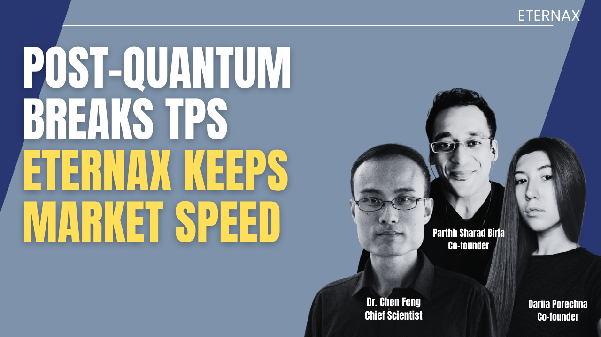
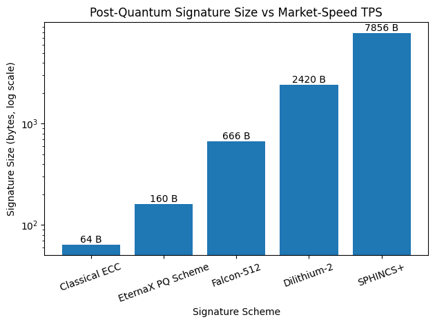

# $3 Trillion Must Migrate: EternaX Makes Bitcoin and Ethereum Day-One Post-Quantum Safe Without the Falcon-Class TPS Cliff

**It Is a Migration Problem for $3 Trillion of Crypto Assets.**

For years, post-quantum cryptography (PQC) in crypto was treated as an academic concern. That phase is over. What matters now is not whether quantum-safe cryptography exists. It does. What matters is whether it can be adopted without destroying throughput, liquidity, and decentralization. Most chains fail that test.

## The Installed Base at Risk Is Already $3.08 Trillion
Looking at the Top-100 crypto assets by settlement domain, we already have a ~$3.08T installed base:

- Bitcoin settlement domain: ~$1.84T (~60%)

- Ethereum settlement domain (L1 + L2s): ~$454B (~15%)

- Multi-chain assets (mostly stablecoins): ~$286B (~9%)

This is not speculative value. This is collateral, liquidity, payments flow, and market structure.

When the authorization model behind that value becomes questionable, markets do not debate. They reprice and reroute.

## Why Migration Is Forced (Not Optional)
Post-quantum risk does not need to “hit tomorrow” to force migration. It only needs to enter the risk-management horizon.

Once that happens, the response is mechanical:

1. Collateral haircuts appear. Lending power drops. Capital efficiency collapses.
2. Margin requirements rise. Leverage compresses. Volumes fall.
3. Market makers widen spreads and cut inventory. Execution quality degrades.
4. Custody and exchanges restrict support. Warnings, limits, delisting risk.
5. Issuers reroute issuance. Stablecoins and RWAs choose safer settlement rails.

From there, assets converge toward one of two endpoints:

1. Economic zero: no liquidity, no collateral legitimacy

2. Operational zero: assets lost once signature cryptography fails

There is no stable middle ground. This is why post-quantum migration is not “nice to have.” It is existential.

## The Hidden Constraint Everyone Misses: PQC Imposes a Throughput Tax
Most “just upgrade signatures” narratives collapse on a hard constraint:

Post-quantum cryptography changes the economics of blockchains.

At chain scale, signature footprint turns into three compounding taxes:

1. Propagation tax (bytes per transaction)
2. Verification tax (CPU cost under latency constraints)
3. Archival tax (state growth and long-run node cost)

Those then become a decentralization tax, because higher validation cost shrinks the set of operators who can keep up.

## Start With the Only Comparison That Matters
Representative, commonly implemented signature sizes:

- Classical ECC baseline: ~64 bytes

- [EternaX novel PQ scheme](../silmarils-post-quantum-authentication-without-size-tax/index.html): 160 bytes

- Falcon-512: 666 bytes

- Dilithium-2 (ML-DSA-44): 2420 bytes

- SPHINCS+: 7856 bytes

This is not cosmetic. It is a new cost model.

## The Arithmetic That Breaks Chains
Assume a chain operating where real markets live: ~10,000 transactions per second.

Moving from 64B to 666B signatures adds roughly 600B per transaction.

That becomes:

- ~6 MB per second of extra network traffic

- ~520 GB per day

- ~190 TB per year

That is only the signature delta. Not receipts. Not state diffs. Not overhead.

The outcome is predictable:

- slower propagation

- higher validator hardware requirements

- fewer viable operators

- wider spreads and worse execution

- liquidity migration

**This is the Falcon-class throughput cliff.**

Markets do not accept permanent performance haircuts for security upgrades. They route around them.

## Why EternaX Is Structurally Different
This is where most PQ narratives fail.

EternaX is PQ-native market infrastructure, not a retrofit.

The decisive design constraint is simple:

> **Make post-quantum security cheap enough to adopt at market speed.** 

EternaX discloses a [novel PQ signature design](../silmarils-post-quantum-authentication-without-size-tax/index.html) engineered to stay close to classical economics:

- 160B signatures versus 666B Falcon-class

- Roughly 4× smaller footprint

- Designed to preserve propagation speed, verification budgets, and decentralization

So the claim is not “we support PQC.” Everyone can say that.

The claim is:

**EternaX makes post-quantum safety compatible with market-speed throughput.**

That is the moat.

## What Migration Actually Enables Day One
This is not theoretical:

- Ethereum assets (ETH, ERC-20s, DeFi collateral) can migrate and become post-quantum safe on day one for execution, trading, and collateral use.

- Bitcoin liquidity can migrate and be controlled, traded, and settled under full post-quantum safety on EternaX day one, even while Bitcoin itself upgrades on a longer timeline.

**Markets migrate activity layers first, not ideology.**

That is how value survives cryptographic transitions.

## Why the Urgency Is Real (Even Without a Quantum Breakthrough)
There is no confirmed cryptographically relevant quantum computer today.

What changed is **posture**:

- Core protocol teams now treat PQ as a multi-year engineering migration, not a research topic.

- Wall Street research frames quantum as a portfolio-relevant risk category.

- Major crypto finance discusses it at board and earnings-call level.

- The threat model has converged on key theft via broken signatures, not mining.

- That combination only appears when the planning horizon is single-digit years, not decades.

- Migration lead-time is long. That is why migration rails must exist now.

## The Unavoidable Conclusion
Every crypto asset faces the same fork:

- Migrate to a post-quantum safe execution domain that preserves market speed, or

- Lose collateral status, liquidity, and ultimately value

Post-quantum is not a checkbox. It is a bandwidth and verification bill.

If your chain cannot pay that bill, your liquidity migrates.

EternaX gets it for free.

**Connect: [info@eternax.ai](mailto:info@eternax.ai)**

*EternaX is a high-performance, post-quantum secure market infrastructure blockchain built to keep real markets fast while upgrading cryptographic safety at scale. EternaX is PQ-native, not retrofitted, using a [novel post-quantum signature scheme](../silmarils-post-quantum-authentication-without-size-tax/index.html) (64B public key, 160B signature) engineered to avoid the Falcon-class throughput cliff and preserve market-speed execution with a sub-second finality target (approximately 120ms spendable finality). Crucially, stablecoins and RWAs can be minted natively on EternaX as post-quantum safe from day one, with issuers able to choose EternaX as their canonical settlement and payments rail, rather than inheriting legacy signature risk. In parallel, Ethereum assets (ETH and ERC-20s) and Bitcoin liquidity can migrate to EternaX to become post-quantum safe immediately for trading, settlement, and collateral use, without waiting for base-layer upgrades. Combined with EVM compatibility and auditable privacy for selective disclosure, EternaX is designed as the default migration and issuance home where post-quantum security, high throughput, and market structure coexist without compromise.*