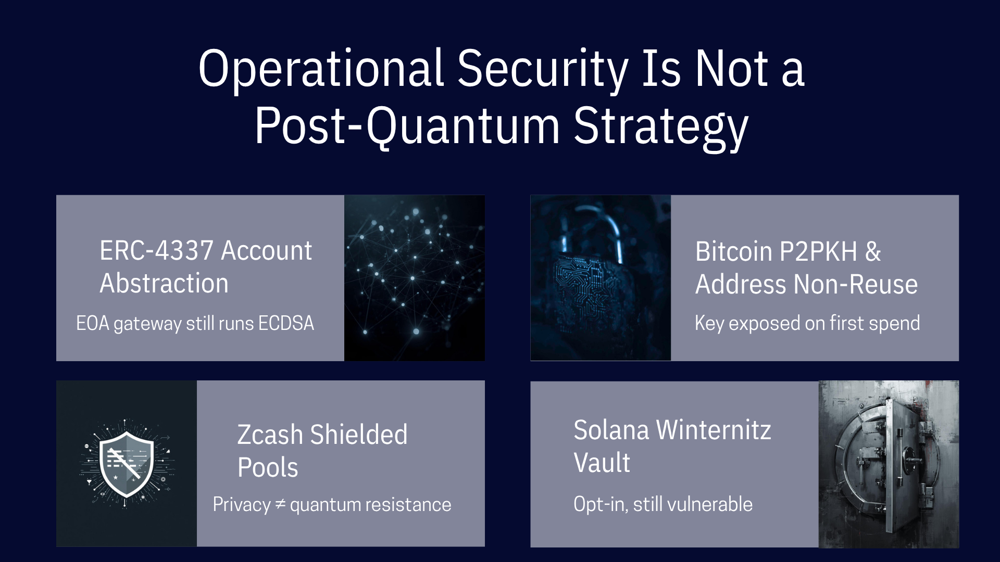

# Hiding Your Public Key Will Not Save Your Coins

## and Why Operational Security Is Not a Post-Quantum Strategy.
 

The crypto community has developed a collection of reassuring narratives about quantum risk: Don't reuse addresses. 
"Use P2PKH on Bitcoin."
"Rely on ERC-4337 on Ethereum."
"Use ZCash shielded pools."
"Solana block time is 400 ms, no CRQC will break a key in mempool in that time". 
The underlying thesis is a consistent misconception: if your public key is never exposed, a quantum computer has nothing to attack. The conclusion drawn from this logic is that careful operational hygiene can substitute for a cryptographic upgrade. This conclusion is wrong.

These measures are not without value. As transitional defenses during a migration to post-quantum cryptography, they buy time. But the growing tendency to treat them as durable solutions reflects a misunderstanding of what cryptographic networks actually are and what happens when their foundational assumptions break.

## The Assumption That Makes Everything Work

Cryptocurrency networks are not databases with extra steps, rather systems that replace institutional trust with mathematical trust. The entire premise is that the underlying cryptography is sound: that a private key cannot be derived from a public key, that a signature cannot be forged, that ownership is defined by knowledge of a secret that is computationally infeasible to guess. Every transaction, every block, every consensus decision rests on this premise. When the math holds, the system functions without banks, courts, or intermediaries. When the math breaks, the system has no fallback, because the absence of intermediaries is the point.

This is the first reason operational stubs fail as long-term strategy. They attempt to preserve a system whose security model has been invalidated. If ECDSA is broken, the question is not whether a particular public key happens to be exposed — the question is whether anyone should trust a network whose fundamental ownership mechanism can be circumvented by a sufficiently equipped adversary. The answer is no. Not because every coin will be stolen immediately, but because the credibility of the entire asset class depends on the hardness of the underlying problem.

There is a revealing contradiction at the heart of the "just don't expose your public key" defense. A public key is, by definition, public. The entire design of public-key cryptography rests on the principle that the public key can be freely shared without compromising the private key. That is what makes it useful and what distinguishes it from a shared secret. The moment a system's security depends on keeping public keys hidden, something has gone fundamentally wrong. You are no longer relying on the mathematical hardness of the cryptographic scheme. You are relying on secrecy, the very model that public-key cryptography was invented to replace.

If operational discipline were sufficient to secure digital assets against a broken signature scheme, we would not need blockchains at all. We would use authenticated databases with access control lists. The reason cryptographic networks exist is precisely that security must be a property of the protocol, not of user behavior. The moment security becomes contingent on every participant never making a mistake, the system has reverted to the trust model it was designed to eliminate.

## The Specifics Fall Apart Under Scrutiny

Consider the most commonly cited defenses:

### Bitcoin P2PKH and address non-reuse. 
Pay-to-Public-Key-Hash scripts hide the public key behind a hash. As long as the key is never revealed, it cannot be targeted by a quantum computer. This is technically accurate and practically irrelevant. The public key is revealed the moment the owner spends from the address. At that point, any remaining funds at the address become vulnerable to at-rest attacks. More importantly, address reuse is not a rare edge case — it is the norm. [Google cites](https://arxiv.org/abs/2603.28846) of the Bitcoin blockchain found that approximately 6.9 million BTC across all protocol types are currently vulnerable to at-rest quantum attacks, largely due to key reuse. Major exchanges, including some of the largest in the world, routinely reuse addresses for operational convenience: whitelisting, reserve proofs, fee consolidation. Hierarchical deterministic wallets mitigate the problem for individual users, but the ecosystem as a whole has built workflows, services, and business logic on the assumption that public keys are safe to share. That assumption is what CRQCs will break.

### ERC-4337 and account abstraction. 
On Ethereum, account abstraction allows users to interact through smart wallets with customizable authentication logic, enabling more frequent key rotation and decoupling identity from a single static keypair. This is a genuine improvement for operational flexibility. But as the authors of the Google whitepaper observe, these enhancements "mitigate the symptoms and not the root cause: the only gateways for external agency into Ethereum are the vulnerable EOAs." Every smart wallet still depends on an externally owned account to initiate transactions. That account's signature scheme is ECDSA. If ECDSA falls, the gateway falls, regardless of what abstraction layer sits above it. Key rotation helps only if rotation outpaces the attacker, and rotation to another ECDSA key rotates to the same vulnerability.

### Zcash and shielded transactions. 
Zcash is frequently cited as a counterexample on the grounds that its shielded pool makes transaction amounts and addresses invisible to outside observers. This conflates two distinct properties: cryptographic privacy and cryptographic hardness. The Sapling and Orchard shielded protocols use zk-SNARKs to hide transaction details, but the spending authority over shielded funds still rests on elliptic curve cryptography — specifically the Jubjub curve. Jubjub is an elliptic curve. It is vulnerable to Shor’s algorithm for the same reason secp256k1 is: its security reduces to the hardness of the discrete logarithm problem on a group whose structure a quantum computer can efficiently exploit. A Zcash shielded address hides your balance from chain observers; it does not hide your keypair from a CRQC. Privacy and quantum resistance are orthogonal properties, and systems that achieve the former provide no guarantee of the latter.

### Solana and the Winternitz Vault 
Last year, Dean Little introduced the Winternitz Vault to Solana, an optional smart contract using hash-based one-time signatures that are genuinely resistant to Shor’s algorithm. But the vault’s own documentation notes that if the update authority of the deploying program is a standard elliptic curve keypair, funds remain at risk: a quantum-resistant vault sitting on a quantum-vulnerable deployment key. The underlying network continues to run on Ed25519 (a different elliptic curve, the same vulnerability class), and no protocol-level migration is announced. An opt-in tool that requires users to manage vault lifecycles and trust that deployment keys have also been secured is not a network security guarantee. It is a security option, available to the fraction of users technically equipped to exercise it correctly.

## People Are Bad at Operational Security

The second reason these defenses fail is simpler: they require perfect, perpetual discipline from every participant in the network.

This is not a hypothetical concern. The historical record of operational security in cryptocurrency is one of consistent, large-scale failure. Users reuse addresses. Exchanges publish static deposit addresses. Wallets default to convenience over caution. Extended public keys are shared with portfolio tracking services. Private keys are reused across chains, spending on Bitcoin Cash exposes the same key on Bitcoin. Sidechains like Rootstock allow users to omit destination addresses, automatically deriving them from the same keypair that signed the Bitcoin transaction. The entire ecosystem has been optimized for a world where public key exposure is harmless.

Telling billions of potential users that their assets are safe as long as they follow a precise set of hygiene rules (that most existing users already violate) is not a security strategy. It is a liability disclaimer. Billions in losses occur between "theoretically possible to avoid exposure" and "reliably achieved at scale". When the defense against a catastrophic attack reduces to "just don't make a mistake, ever," the defense is as good as nothing.

This is especially true for Ethereum, where the account model structurally incentivizes long-lived accounts. Users accumulate DeFi positions, governance history, and reputation on a single address. The moment that account sends its first transaction, the public key is exposed permanently. There is no "careful use" that avoids this, it is built into the architecture.

## Transitional, Not Terminal

None of this means these measures are worthless. In a world where slow-clock quantum architectures arrive before fast-clock ones, mitigations like eliminating address reuse and removing vulnerable spending paths (such as BIP-360's proposed P2MR script type) provide genuine, if partial, protection against at-rest attacks. They reduce the attack surface while the harder work of deploying post-quantum cryptography proceeds.

But "useful during transition" is categorically different from "sufficient as a permanent solution." The distinction matters because the narrative around operational defenses has begun to function as a reason to delay the transition itself. If the community believes that hygiene alone provides adequate protection, urgency evaporates. And urgency is precisely what the situation demands. The migration to post-quantum signature schemes is a logistically complex process. On Bitcoin alone, at current transaction rates, migrating all assets to post-quantum addresses would take months even if the network processed nothing else. The process must begin before CRQCs arrive, because it cannot be completed quickly once they do.

## The Cost of False Comfort

The danger of operational security narratives is not that they are technically incorrect in the narrow sense. Hiding a public key behind a hash does protect against at-rest attacks, assuming the key is never exposed, the owner never spends from the address, no cross-chain leakage occurs, and the attacker is using a slow-clock CRQC. Each of these assumptions can fail independently.

The danger is that these narratives provide false comfort to asset holders who conclude that migration is unnecessary: that they can "sit it out", that the problem is manageable with discipline alone, etc. A network whose signature scheme is broken is a network whose core proposition (ownership model) is broken. Operational workarounds do not change this fact. They delay the consequences.

Cryptographic networks were built on the premise that security is enforced by mathematics, not by behavior. Post-quantum cryptography preserves that premise. Operational hygiene does not. The long-term choice is not between careful key management and careless key management, but between systems that are cryptographically sound and systems that are not.
