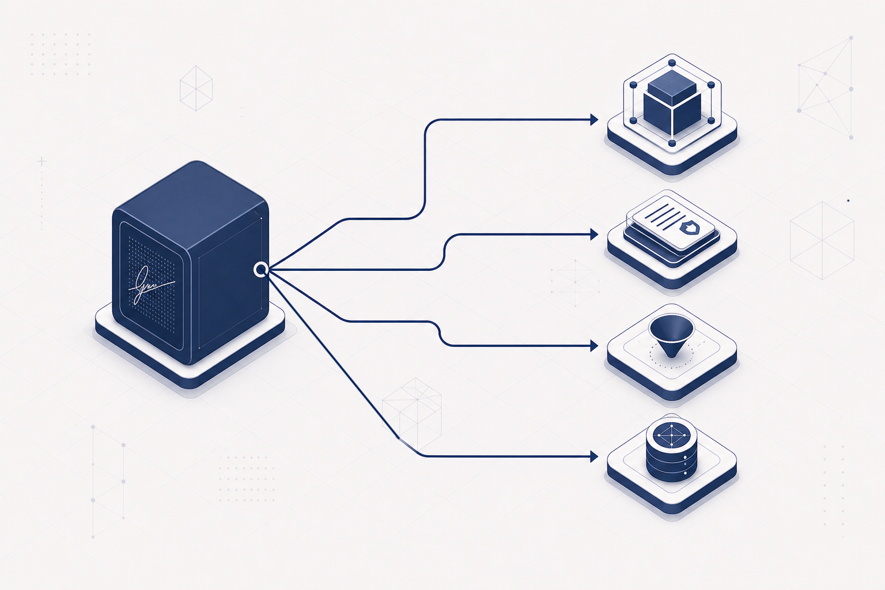

# So How Do You Actually Get Crypto-Agile?

[NIST defines crypto-agility](https://doi.org/10.6028/NIST.CSWP.39) as the ability to replace and adapt cryptographic algorithms while preserving security and ongoing operations. That definition describes a result. It says nothing about how an existing authentication architecture is supposed to arrive there.

For authentication systems, the obstacle is the signature bundle. Many systems do not use signatures only as signatures. They use one compact object to carry identity, authorization, admission into a protocol, and later evidence. That was tolerable when the object was a 64-byte elliptic-curve signature. But it is still an optimization, not a law. Once that bundled object is no longer cheap, simple algorithm replacement does not produce agility. It moves the same coupling onto a larger and more expensive object.

Unbundling is how an authentication system arrives at crypto-agility. Our earlier writings applied the decomposition to [transaction signatures on a BFT settlement path](../unbundling-transaction-signature/index.html) and to [MPC custody](../post-quantum-mpc-custody-on-chain/index.html).

## The signature bundle

A digital signature proves that a private key signed a message under a verification key. In deployed systems, that object is often asked to do four jobs at once.

| Job                   | Question answered                                | Typical lifetime                        |
| --------------------- | ------------------------------------------------ | --------------------------------------- |
| Identity binding      | Which authority, account, or credential is this? | Account, credential, epoch, institution |
| Message authorization | Was this specific payload approved?              | Action, transaction, session            |
| Local admissibility   | May this action enter the protocol path?         | Immediate execution path                |
| Durable evidence      | What can a later party verify?                   | Audit, bridge, asset, legal, archive    |

Under classical signatures, these jobs were cheap to bundle. ECDSA and EdDSA made public verification small, fast, and easy to archive. A single signature could travel with every action and serve every audience. Authentication became, by default, one publicly verifiable object.

That convenience hardened into architecture. The hardness assumption, encoding formats, verifier model, and evidence procedures traveled together because the object was small enough that nobody had to ask whether they belonged together.

## The cost and risk changed

Post-quantum signatures change the cost of that optimization. Faster cryptanalysis changes its risk. Long-lived institutional records change the evidence requirement.

ML-DSA and SLH-DSA are kilobytes where elliptic curve signature was 64 bytes: acceptable at issuance or rotation, not as a permanent object on every protocol path.

And the risk is no longer only quantum. [Quasipolynomial cryptanalysis of McEliece](https://eprint.iacr.org/2026/1630), a [key-recovery reduction for HAWK](https://eprint.iacr.org/2026/1593), and [machine-assisted discovery of cryptographic weaknesses](https://www.anthropic.com/research/discovering-cryptographic-weaknesses) are not predictions that any one standard fails tomorrow. They are evidence that the search for structure in public-key schemes is still accelerating. If identity, authorization, admissibility, and evidence all depend on the same construction and encoding, a scheme break, an implementation defect, or a standards migration forces every boundary to move at once.

That is the architecture problem.

## Interface agility is not enough

The standard tools are still the right tools at the interface. Algorithm identifiers make the wire format extensible. Provider APIs make the library swappable. Hybrid signatures make the transition dual. Each of these is useful. None of them is sufficient if the object being identified, swapped, or hybridized is still doing different jobs for different audiences.

[Ethereum blob data availability](https://eips.ethereum.org/EIPS/eip-4844) is the concrete case. It is built on KZG commitments over BLS12-381. Commitment, opening, and sampling are pairing jobs fused into that curve, not a signature with an algorithm identifier. Swap BLS for a different signature scheme and the DA path does not migrate. It stops working.

An identifier does not isolate a job, it labels a bundle. A hybrid does not unbundle a job. It duplicates the bundle. A modular API can hide an implementation change from application code and still leave custody workflows, audit logic, packet formats, and historical records coupled to the same artifact. If those couplings remain, the system has modular cryptography, not structural agility.

The design question is therefore not which post-quantum signature to use. We have to determine which authentication jobs actually require the same verifier, trust anchor, lifetime, hardness assumption, state, failure domain, and evidence procedure. If the answer is not all of them, the jobs should not live in one object.

## How to achieve crypto-agility

Start with the jobs the current object is secretly doing, then make those jobs independently replaceable. The method has six steps.

### 1. Inventory jobs, not algorithms

List every authentication artifact in the system: signatures, MACs, certificates, session tokens, quorum certificates, HSM receipts, logs, and finalized state commitments. For each artifact, name the jobs it currently performs. Most production systems discover that one object is doing more than one job.

This inventory is not a cryptographic bill of materials. A CBOM can tell you which algorithms you have. It cannot tell you which business path will break when one of them is withdrawn. If you cannot name the job, you cannot migrate the object without rewriting the path that depends on it.

### 2. Classify each artifact

For every authentication artifact, answer:

| Dimension      | Question                                                                    |
| -------------- | --------------------------------------------------------------------------- |
| Job            | What function is this artifact performing?                                  |
| Verifier       | Who must be convinced?                                                      |
| Trust anchor   | What does that verifier rely on?                                            |
| Lifetime       | How long must the claim remain meaningful?                                  |
| Hardness class | Which assumption protects the claim?                                        |
| State          | Does verification need a session, committee, registry, or only public data? |
| Failure domain | What else fails if this primitive, key, encoding, or operator fails?        |
| Evidence       | What remains checkable after the event, and by whom?                        |

Two authentication jobs belong in the same artifact only when they require the same verifier model, trust anchor, lifetime, hardness class, state, failure domain, and evidence procedure.

If the dimensions match, bundling may be correct. If they do not match, bundling creates migration coupling and security concentration. The rule is conservative on purpose. The cost of a false split is an extra interface. The cost of a false bundle is a rewrite.

### 3. Name the verifier before choosing a primitive

The verifier is the variable that is usually missing from migration debates. Primitive choice is treated as a matter of taste, conservatism, or standards compliance. It is more often a matter of audience.

| Verifier model             | What it needs                               | Natural tools                                                      |
| -------------------------- | ------------------------------------------- | ------------------------------------------------------------------ |
| Universal public verifier  | Anyone can check later from public data     | Public-key signatures, certificates, transparency logs             |
| Protocol-path verifier     | A named participant checks now              | MACs, authenticated channels, designated verification, local state |
| Committee verifier         | A threshold or BFT group decides            | Consensus, quorum certificates, threshold checks                   |
| Enforcement-layer verifier | Policy satisfaction is checked              | Policy engine, authorization proof, registry, HSM workflow         |
| Future auditor             | A past event can be reconstructed or opened | Receipts, logs, finalized state, evidence chains                   |

A universal public verifier is the strongest audience. It needs an artifact that can stand alone. A protocol-path verifier is narrower: it operates inside an authenticated session, committee, ledger state, or enforcement layer, and it may need immediate conviction rather than a permanent public proof. A future auditor is different again. It needs evidence that remains meaningful relative to a named trust anchor and procedure. A public signature is one possible evidence object. It is not the definition of evidence.

Once the verifier is explicit, primitive choice becomes less ideological.

| Job                   | If the verifier is public                                  | If the verifier is named or stateful                                 |
| --------------------- | ---------------------------------------------------------- | -------------------------------------------------------------------- |
| Identity binding      | Conservative public-key signature, certificate, credential | Session-bound key, registry entry, organizational authority document |
| Message authorization | Public signature over the payload                          | MAC, designated-verifier authentication, channel-bound proof         |
| Local admissibility   | Public predicate plus state checks                         | Local policy, BFT admission, HSM workflow, authenticated session     |
| Durable evidence      | Public signature, certificate chain                        | Receipt, log inclusion, finalized state commitment, evidence chain   |

This is not an argument against public-key signatures. It is an argument against using them by reflex. Public-key signatures are the right tool when the verifier must be public, independent, and durable. They are not automatically the right tool when the verifier is named, online, stateful, or part of a consensus path. Public-key primitives belong at trust boundaries where the verifier is unknown. The protocol path can often run on hashes, MACs, authenticated channels, commitments, logs, or committee assumptions, without importing a public-key migration calendar into the hot path.

### 4. Write a substitution contract

A replaceable job needs a contract that outlives a specific implementation:

1. The security property the job must preserve.
2. The verifier and trust anchor that may be used.
3. The encodings, key types, and implementations that may change.
4. The application semantics that must not change.
5. The evidence that must remain meaningful, expire, or be re-issued.

The primitive implements the contract. The contract does not inherit the primitive's wire format, key size, or migration calendar. If changing SLH-DSA for ML-DSA still forces a rewrite of custody workflows, audit logic, or packet formats, the contract was never isolated. The algorithm changed. The architecture did not.

### 5. Measure migration risk

Ask one operational question for each artifact: if this primitive is withdrawn tomorrow, what else must move?

Count the forced changes: keys, certificates, session state, wire formats, storage, verification paths, custody workflows, policy engines, bridges, and historical records.

A bundled signature has a large blast radius because identity, authorization, admission, and evidence all move together. An unbundled design is crypto-agile only when that radius shrinks and the remaining trust movement is explicit. If the radius does not shrink, the system has modular APIs, not structural agility.

### 6. Design the transition, then prove it

Replacement is a protocol, not a configuration change. For each substitution class, specify:

| Transition step     | What must be true                                                                    |
| ------------------- | ------------------------------------------------------------------------------------ |
| Dual operation      | Old and new artifacts can coexist without ambiguous interpretation.                  |
| Cutover             | The activation boundary is exact: time, epoch, key, or profile.                      |
| Rollback            | The system can return to a known-good profile without silent downgrade.              |
| Compromised root    | Alternate roots, dual authorization, or recovery paths are named in advance.         |
| Evidence continuity | Historical claims remain verifiable, are re-issued, or expire under a stated policy. |
| Residual exposure   | Operators can say what old keys, ciphertexts, or signatures still prove.             |

Then withdraw one primitive on paper or in a staging system and trace every affected claim. If the drill requires an application rewrite, the architecture is not agile yet. Agility that exists only in an API diagram is not agility.

## Two worked examples

The two earlier posts are instances of this method. The settlement case unbundles a transaction signature. The custody case unbundles a threshold signature. The jobs are different. The rule is the same.

### Settlement

In a bundled post-quantum settlement design, every transaction carries a public signature that binds identity, authorizes the action, gates admission, and remains as evidence forever. That is the classical ECDSA bargain continued at a new price.

An unbundled design asks what each job needs.

| Job                   | Concrete design question                              | Possible answer                                        |
| --------------------- | ----------------------------------------------------- | ------------------------------------------------------ |
| Identity binding      | How is the account or institution rooted?             | Hash-based PQ credential or public key                 |
| Message authorization | Who must be convinced that this payload was approved? | Validator, counterparty, or committee path             |
| Local admissibility   | Who decides whether it enters the ledger?             | BFT validators under protocol rules                    |
| Durable evidence      | What must an auditor or bridge check later?           | Finalized receipt, state commitment, or evidence chain |

The identity root can be conservative and public. Hot-path authorization can be compact and verifier-specific. Admissibility can be tied to consensus. Evidence can be generated after finality for the parties that actually need it.

That is the pattern in [Unbundling the Transaction Signature](../unbundling-transaction-signature/index.html). Conservative post-quantum signatures stay where universal public verification is actually needed. BFT finality is named as the public trust anchor. A compact finality-anchored receipt carries later audit. The result is not only a smaller object. It is a substitution contract in which the hot path no longer inherits every public-key migration.

### Custody

MPC custody shows the same problem from the control-plane side. Classical custody often bundles member authentication and threshold authorization into one threshold signature workflow: if enough parties participate, the system emits one signature that the asset rail accepts. Threshold ECDSA made that bundle convenient. It did not make the two jobs identical.

Post-quantum migration breaks the convenience. Standardized hash-based signatures do not naturally support efficient threshold signing, and lattice threshold signing remains an active research and deployment problem. Searching for "the post-quantum threshold signature" therefore preserves the wrong abstraction.

A signature-agnostic custody design unbundles the jobs:

| Job                     | Bundled TSS design                                       | Unbundled custody design                                         |
| ----------------------- | -------------------------------------------------------- | ---------------------------------------------------------------- |
| Member authentication   | Hidden inside threshold signing                          | Each member signs an approval under any EUF-CMA signature scheme |
| Threshold authorization | The threshold signature is the authorization             | A quorum produces a separate threshold seal over the operation   |
| Local admissibility     | Asset rail accepts the resulting signature               | Enforcement layer checks both member signatures and the seal     |
| Crypto-agility          | Changing signature scheme changes the threshold protocol | Changing signature scheme is key rotation, not protocol redesign |

This is unbundling as an agility mechanism, which is the argument of [Post-Quantum Custody On-Chain](../post-quantum-mpc-custody-on-chain/index.html) and the accompanying [signature-agnostic MPC custody paper](https://arxiv.org/abs/2607.08226). The member-signature scheme becomes a deployment parameter: ECDSA, ML-DSA, SLH-DSA, or another EUF-CMA signature can authenticate members without becoming part of the threshold authorization computation. The threshold seal carries the distributed-approval property. The enforcement layer decides whether both gates are satisfied. Migrating a member from ECDSA to SLH-DSA is key rotation. It is not a new distributed key generation, a new combination algorithm, and a new security analysis of the control layer.

## What makes unbundling valid

The settlement design is valid because BFT finality is named as the public trust anchor and the receipt is named as the evidence procedure. The custody design is valid because member authentication, the threshold seal, and the enforcement layer are three proofs with three jobs. Unbundling is not valid because a system is faster. It is valid only when the replacement trust anchor is explicit.

A serious design must state:

1. Which party verifies each job.
2. Which trust anchor supports that verification.
3. Which evidence remains after the event.
4. How replay, revocation, and downgrade are handled.
5. What changes if the primitive or assumption class fails.

A design that replaces "public signature" with "trust the system" has not unbundled authentication. It has removed a proof. A valid unbundled design replaces one proof with a named verifier, named trust anchor, named lifetime, and named evidence procedure.

## What agility looks like after unbundling

Fragments of this decomposition already appear in deployed systems: PBFT used MACs for internal replica authentication, IETF evidence drafts separate verification from authority and evidence satisfaction, and ZK authorization work separates authorization semantics from transaction-carried signatures. The framework above unifies those fragments into one operational rule.

If authentication is bundled, algorithm replacement can force changes across wire formats, storage, custody flows, audit logic, policy semantics, and verification paths.

If authentication is unbundled, migration can be localized:

- identity roots can rotate when public-key standards change;
- protocol-path authorization can use stable channel or committee assumptions;
- durable evidence can retain the procedure needed by auditors, bridges, or regulators;
- hot-path formats do not automatically inherit every public-key migration.

That is the operational value of unbundling. It turns crypto-agility from a desired outcome into an architecture property: future cryptographic changes have fewer places to break the business system.

## Conclusion

Post-everything cryptography is not only about choosing the next signature. It is about not asking one object to be identity, authorization, admission, and evidence unless those jobs truly have the same verifier, trust anchor, lifetime, hardness class, and evidence procedure.

The method is:

1. Inventory the jobs, not the algorithms.
2. Classify each artifact by verifier, trust, lifetime, assumption, state, failure domain, and evidence.
3. Split jobs whose dimensions do not match.
4. Write a substitution contract before selecting a primitive.
5. Measure the blast radius of a withdrawal.
6. Specify the transition and prove that historical evidence still means something.

Authentication is not one object. It is a set of jobs. Crypto-agility is not an algorithm identifier. It is the architecture that lets those jobs change independently.

## Sources and further reading

- NIST, [Considerations for Achieving Crypto Agility: Strategies and Practices (CSWP 39)](https://doi.org/10.6028/NIST.CSWP.39), 2025.
- Ashrujit Ghoshal, Yuval Ishai, Aayush Jain, and Nuozhou Sun, [Quasipolynomial Cryptanalysis of the McEliece Cryptosystem](https://eprint.iacr.org/2026/1630), 2026.
- Zygimantas Straznickas and Stephen A. Weis, [HAWK-n Key Recovery Reduces to SVP in Dimension n/2 + 1](https://eprint.iacr.org/2026/1593), 2026.
- Anthropic, [Discovering cryptographic weaknesses with Claude](https://www.anthropic.com/research/discovering-cryptographic-weaknesses), 2026.
- I. Schrock, [Authorization Evidence Chains: Composing Heterogeneous Agent-Action Evidence](https://datatracker.ietf.org/doc/draft-schrock-ep-authorization-evidence-chain/), 2026.
- I. Schrock, [Authority Documents and Scoped Authority for Agent-Action Evidence](https://datatracker.ietf.org/doc/html/draft-schrock-ep-authority-introduction-03), 2026.
- J. S. Wang, [ZK-ACE: Identity-Centric Zero-Knowledge Authorization for Post-Quantum Blockchain Systems](https://doi.org/10.48550/arxiv.2603.07974), 2026.
- Dariia Porechna, [Threshold Authorization Without Threshold Signatures: Signature-Agnostic MPC Custody](https://arxiv.org/abs/2607.08226), 2026.
- Miguel Castro and Barbara Liskov, [Practical Byzantine Fault Tolerance](https://pmg.csail.mit.edu/papers/osdi99.pdf), 1999.

