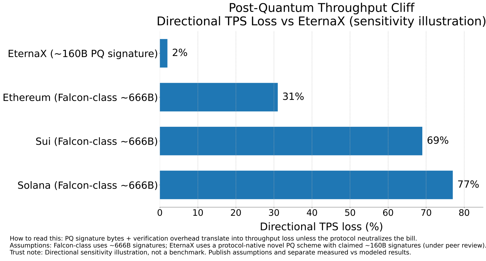

# “Migrate Later” Is a Stablecoin Liquidity Risk: Why PQ-Native Day One Wins Distribution

.png)

### **The quantum threat is not a date. It is a coordination race. Stablecoins cannot afford to lose that race.**

> Post-quantum security is not a future patch. It is a multi-year migration that must start before certainty arrives. The uncomfortable truth is simple. The work is slow. The capability curve can accelerate. That mismatch is the risk.
> 

For stablecoins, “we will migrate later” is not a technical plan. It is a distribution and liquidity risk.

This article has two halves:

1. What leading experts are warning about, including the issuer-relevant mechanics and failure modes.
2. What it implies for stablecoins, and why “PQ-native day one” is an adoption lever, not a nice-to-have.

---

### **Part I. Ground truth from the experts: what breaks and how markets lose**

### **1) What quantum breaks, specifically**

**Justin Drake** describes the threat in concrete crypto terms. Quantum attacks target elliptic-curve cryptography across multiple layers of modern chains:

- ECDSA for user transactions
- BLS signatures in consensus layers
- KZG commitments in data availability structures

**Chris Peikert** reinforces the systems point. When the cryptographic foundation fails, everything built on top inherits the failure. This is why the risk is systemic.

Issuer takeaway: stablecoins are financial infrastructure that inherits base-layer cryptographic risk by default.

---

### **2) How the loss happens in practice: minutes-to-break plus quiet key-harvest**

The operational failure mode is not theoretical:

- In fast quantum modalities, key-breaking can be on the order of **minutes**, with an estimate discussed as roughly **10 minutes per key**.
- Public-key exposure matters because an attacker can compute secret keys privately, accumulate targets, and only later broadcast draining transactions.

This matters because it kills the comforting belief that markets get a long, clean warning period. Quiet harvest first. Visible drains later.

Issuer takeaway: reactive migration under stress is not a plan. It is an outage and a confidence event.

---

### **3) Why “only a subset is vulnerable” is the wrong comfort**

Two dynamics make the “limited impact” argument fragile:

1. **Scale-up is fast after liftoff.** Going from one capable machine to many can happen quickly.
2. **Attackers optimize for surprise.** The best move can be to harvest keys quietly, then drain in a coordinated action once advantage is large enough.

Issuer takeaway: the risk is not a slow drip. It is a coordination shock.

---

### **4) The throughput cliff is commercial physics, not ideology**

This is the hinge point for stablecoins and real markets.

The experts frame the “size problem” plainly:

- ECDSA signatures: ~**64 bytes**
- A common PQ benchmark: Falcon-512 at ~**666 bytes**
- If signature bytes rise by ~10x while block size remains scarce, throughput can fall by ~10x unless the chain redesigns around the bytes-and-verification bill.

The illustrative consequences are straightforward:

- Bitcoin: ~3 TPS to ~0.3 TPS
- Ethereum: ~25 TPS to ~2.5 TPS
- Solana: ~1000 TPS to ~100 TPS

Issuer takeaway: a PQ upgrade that destroys market speed is a commercial failure even if it is cryptographically correct.

---

### **5) Coordination is the bottleneck: Bitcoin is the cleanest case study**

The risk is not just cryptography. It is upgrade cadence, governance incentives, and migration coordination.

**Nic Carter**’s core warning is directionally simple: many decision-makers are not strongly incentivized to talk about risk, even if they privately appreciate it. That slows action.

The experts also emphasize the operational reality of migration:

- Even cycling through every UTXO is discussed as taking about **three months** if the chain did nothing else, and longer under normal constraints.
- The “Satoshi coins” overhang is framed as uniquely destabilizing due to scale, discussed as roughly **5%** of supply.

Named examples in the debate highlight the coordination friction:

- **Adam Back** is referenced as dismissive in the framing.
- **Jonas Nick** and **Mihal Kudinov** are framed as taking the issue seriously.

Issuer takeaway: “we will inherit the base chain upgrade” means inheriting governance and coordination timelines you do not control.

---

### **6) The strategic reframe: PQ can be offensive, not defensive**

The strongest point is not fear. It is advantage.

The experts explicitly reframe PQ as an **offensive strategy** to attract serious capital and risk-aware counterparties. That is the correct lens for stablecoins, where trust and continuity are the product.

Issuer takeaway: PQ-native is not just about avoiding catastrophe. It is a distribution wedge.

---

### **Part II. Stablecoins: “PQ-native day one” is a distribution advantage (Best, tighter VC cut)**

> Stablecoin issuance is not a contract. It is a distribution system. The moment a stablecoin succeeds, it becomes embedded across exchanges, custodians, market makers, payments, treasury ops, collateral systems, and risk committees. That embeddedness is exactly why “we will migrate later” is dangerous.
> 

The question is not whether an upgrade is technically possible. The question is whether your liquidity survives the upgrade.

---

### **1) The stablecoin failure mode: liquidity fracture**

A stablecoin dies in the real world the same way it dies in markets: through confidence and continuity.

- Distribution becomes deep and global.
- A post-quantum migration becomes urgent.
- Integrators move at different speeds. Wallets, custody stacks, exchanges, and venues do not upgrade in lockstep.
- Deposits, withdrawals, and settlement guarantees become inconsistent or paused.
- Liquidity fragments across versions and support states.
- The narrative flips from “cash-like” to “operationally unreliable.”

In stablecoins, reliability is the product. When rails look unreliable, the market prices that like solvency.

---

### **2) Why “wait for base-chain PQ upgrades” fails twice**

**A) You do not control the schedule.** Base-layer upgrades are governed by social consensus and ecosystem coordination. Issuers cannot bet distribution on timelines they cannot enforce.

**B) Even successful upgrades can be throughput-fatal.**

This is the fatal combination: delayed plus throughput-fatal.

---

### **3) The issuer posture that wins: PQ-native day one**

The highest-trust issuer statement is straightforward:

**Day-one PQ-native issuance means your stablecoin is born with a PQ-safe authorization perimeter. No emergency perimeter migration event later.**

That compounds across distribution:

- Easier approvals from risk committees and compliance.
- Cleaner continuity story for exchanges and custodians.
- Fewer integration-state failure modes for market makers.
- Better long-horizon reliability for payments and treasury rails.

PQ becomes an adoption wedge, not a future liability.

---

### **4) Where EternaX fits: market-speed PQ plus auditable privacy, driven by a protocol-native novel scheme**

Many networks will add PQ compatibility. The differentiator is whether PQ preserves market speed and whether privacy remains auditable.

EternaX is engineered around a **[protocol-native novel PQ scheme](../silmarils-post-quantum-authentication-without-size-tax/index.html)** specifically to avoid the Falcon-class throughput cliff and keep markets fast while upgrading authorization safety. In EternaX materials, the signature size is 160 bytes, with low single-digit overhead rather than Falcon-class haircuts.

EternaX also adds **auditable privacy**: selective disclosure with verifiable controls, enabling serious flows without choosing between fully public rails and opaque privacy.

---

### **5) Modeled TPS-loss sensitivity: EternaX vs Falcon-class assumptions**

Modeled TPS-loss sensitivity snapshot (mechanism illustration):

- **EternaX**: ~2% overhead
- **Solana (Falcon-class)**: ~77% TPS loss
- **Sui (Falcon-class)**: ~69% TPS loss
- **Ethereum (Falcon-class)**: ~31% TPS loss

---

### **6) The repeatable wedge**

- Stablecoins cannot tolerate a forced perimeter migration without liquidity fracturing.
- PQ creates a throughput cliff unless the protocol neutralizes the bytes-and-verification bill.
- The winning posture is **PQ-native day one + market-speed PQ + auditable privacy**.
- EternaX’s advantage is that this is driven by a **[protocol-native novel PQ scheme](../silmarils-post-quantum-authentication-without-size-tax/index.html)**, not a bolt-on.

### **Closing**

If you mint a stablecoin, you are minting an authorization perimeter that must survive years of market stress and future cryptographic transitions.

The experts’ warning is consistent: quiet attacks, scale-up dynamics, and the throughput cliff. Waiting for certainty is how you lose the race.

So the issuer question becomes obvious:

Do you want your stablecoin to be forced into a future migration event, or do you want it born PQ-native from day one?

EternaX is built for the second answer, with the additional commercial requirement that matters: post-quantum security that does not sacrifice market speed.

**Connect: [info@eternax.ai](mailto:info@eternax.ai)**

*EternaX is a post-quantum, market-speed blockchain built for stablecoins, tokenized cash, RWAs, and high-velocity on-chain markets. Its core advantage is a **[protocol-native novel post-quantum scheme](../silmarils-post-quantum-authentication-without-size-tax/index.html)** designed to keep real markets fast while upgrading authorization security. In EternaX materials, the PQ signature size is **~160 bytes**, targeting **low single-digit overhead** and **~120ms spendable finality**, rather than accepting Falcon-class throughput haircuts that can compress TPS, raise fees, and degrade liquidity. EternaX also provides **auditable privacy** (selective disclosure with verifiable controls) so serious flows can move with transparency where required and confidentiality where necessary. For issuers and investors, the wedge is direct: **mint PQ-native stablecoins day one**, avoid future perimeter-migration and liquidity-fracture risk, and scale on rails engineered for speed, security, and continuity. For more details, contact [**info@eternax.ai**](mailto:info@eternax.ai).*