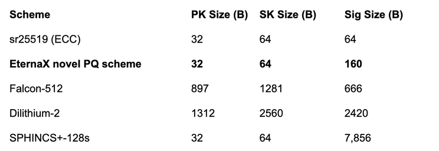

# Mint New Dollars Onchain on a Post-Quantum Settlement Rail

> **Why PQC makes “where you mint” the most important decision in stablecoins and tokenized RWAs, and why EternaX is built to be the default home**

If you are a stablecoin issuer, a tokenized treasury platform, or an RWA originator, you are not “launching a token.” You are issuing a long-duration liability. That liability inherits the cryptographic security envelope of its settlement rail.

**Uncomfortable framing:**

>Mint on a non-post-quantum rail today, and you mint an asset plus embedded migration debt.

That migration will not happen in a calm window. It happens under stress: fragmented liquidity, wallet and custody upgrades, exchange coordination, and real balance-sheet and confidence risk.

Post-quantum cryptography (PQC) is no longer academic. Finance has started treating it as a multi-year execution program.

So the rational default for mint new dollars onchain is simple: **Mint PQ-native from day one.** EternaX is engineered to be that PQ-native home for new stablecoin minting and new RWA minting, without collapsing throughput or forcing markets to slow down for safety.

## What changed recently: the posture shift (not the headlines)

The highest-signal indicator is not a flashy “quantum breakthrough.” It is institutional migration posture.

The G7 Cyber Expert Group published a finance-focused roadmap that treats PQC migration as a long-lead operational program (inventory, vendor mapping, testing, staged rollout). That is governance posture, not research curiosity.

The BIS has also emphasized that PQC transition is complex and slow-moving in financial systems, which is exactly why “start later” is not a strategy.

NIST has finalized the first post-quantum cryptography standards (FIPS 203/204/205 for ML-KEM, ML-DSA, SLH-DSA). This is the standardization step that turns “someday” into procurement and rollout.

Central bank language is unusually direct. The Bank of England explicitly frames quantum as a threat to public-key cryptography and highlights harvest-now-decrypt-later risk.

The internet is already migrating where incentives are obvious. Cloudflare reports majority levels of post-quantum protection for human traffic on its network, driven by harvest-now-decrypt-later concerns.

Meaning: if you wait for absolute certainty, you start too late. The transition is designed to take years.

## The failure mode in crypto is not “the whole chain breaks overnight”

It is selective, catastrophic compromise of high-value control.
Quantum risk to crypto is not one monolithic event. It is a set of failure modes that converge on one outcome: forged authorization.

Widely used signature schemes (ECDSA, EdDSA) are the control plane for wallets and asset movement. Under Shor’s algorithm at sufficient scale, the risk becomes key recovery and forged signatures.

Attackers do not need to drain everything. They need to compromise enough high-value keys to trigger confidence shocks: redemption pressure, depegs, collateral cascades, and liquidity fragmentation.

A clean scenario: A credible targeted capability emerges first. A few high-value addresses with exposed public keys are compromised. The market reprices “cryptographic duration risk.” Issuers face a forced migration window while liquidity is already stressed. That is how migration debt becomes a balance-sheet event.

## The issuer rule: do not mint migration debt

When you mint new stablecoins or RWAs, you control the starting conditions:

- key types

- signing rules

- custody model

- settlement environment

- upgrade path and cryptographic agility

That makes issuance the easiest place to be correct from day one.

And the market is already large enough that this matters now:

- Bloomberg (citing Artemis Analytics) reports roughly $33T stablecoin transaction volume in 2025.

- CoinGecko reports total crypto market cap ended 2025 around $3.0T, and stablecoins reached $311.0B.

**Issuer rule:**

> Mint PQ-native on a PQ-native settlement layer.

If you must extend distribution to legacy chains, treat those as time-bounded liquidity exports, not your source-of-truth settlement.

## The hidden constraint everyone misses: PQC imposes a throughput tax

Most “just upgrade signatures” narratives collapse on a hard constraint: bytes and verification cost hit throughput, propagation, and decentralization.

A simple mental model: signature footprint. Below are representative sizes surfaced in common libraries and parameter sets:

- Sources for standardized / commonly implemented sizes: sr25519 constants and documentation.

- Post-quantum algorithm sizes shown (Falcon, Dilithium, SPHINCS) from Open Quantum Safe algorithm pages.

**Practical implication:** If your signatures jump from 64B to 666B or 2420B, that is not cosmetic. It changes block propagation economics and validator verification budgets. At scale, that becomes a structural throughput haircut or a decentralization tax.

Falcon is widely regarded as one of the most size-efficient standardized post-quantum signature families, yet it still carries a large signature footprint for high-throughput blockchains. EternaX’s novel PQ-native signature design targets that exact bottleneck by delivering signatures that are about 4x smaller than Falcon-class, making quantum-safe authorization practical at market speed without a throughput cliff.

Markets do not tolerate permanent performance haircuts. Capital migrates to the rail where PQ safety is “cheap enough” to adopt.

## Why EternaX: PQ-native market infrastructure, not a retrofit
Positioning (the only one that matters): EternaX is a high-performance, post-quantum secure market infrastructure appchain with auditable privacy and sub-second finality (target ~120ms), designed for real markets: prediction markets (live), spot, perps, payments.

Two capital on-ramps (and why this matters):

- Canonical minting (day one): PQ-native stablecoins + PQ-native RWAs (issuance plus payments rail)

- 1:1 migration: lock-and-mint path for legacy liquidity into PQ-secured settlement without waiting for base-layer upgrades

**Decisive wedge:** EternaX discloses a novel PQ signature design engineered to avoid the “Falcon-class throughput cliff.” The claim is not “we support PQC.” The claim is “we make PQC compatible with market-speed throughput.”

- Solana: ~77% modeled TPS loss (Falcon-class assumptions)
- Sui: ~69% modeled TPS loss (Falcon-class assumptions)
- Ethereum: ~31% modeled TPS loss (Falcon-class assumptions)
- EternaX: ~2% modeled TPS loss (EternaX novel scheme)

The real moat is structural: retrofit PQC tends to be throughput-expensive and coordination-heavy. PQ-native design avoids the migration cliff.

## The numbers that quietly force the issuer rule
This is no longer a debate about “if quantum happens.” It is a migration timeline being formalized by finance:

- G7’s roadmap posture signals a long-lead program.

- NIST standardization makes PQ adoption operational.

- The Bank of England is already warning in the language of systemic risk.

- Cloudflare’s traffic data shows PQ protection is already scaling where the incentive is obvious.

- Market infrastructure is explicitly flagging quantum as a risk surface, which is where risk committees live (see World Federation of Exchanges).

- Crypto’s large custodial surfaces are taking it seriously (see Coinbase establishing a quantum advisory board).

Now place market scale next to posture:

- Stablecoins: ~$33T transactions in 2025 (Artemis as cited by Bloomberg).

- Stablecoin value: ~$293.29B and ~223.69M holders tracked by RWA.xyz.

- Tokenized U.S. Treasuries: ~$10.00B total value on RWA.xyz.

- CoinGecko: stablecoins reached $311.0B and total crypto ended 2025 around $3.0T.

Why the underwriting becomes obvious without spelling it out: When flows are already tens of trillions, settlement economics do not need big percentages to matter.

A simple sanity check (not a forecast, just arithmetic on observed flow):

- If a PQ-native settlement rail captures 10% of $33T and takes 0.1 bp (0.001%), that is ~$33M/year.

- At 0.5 bp, ~$165M/year.

- At 1.0 bp, ~$330M/year.

And that is before you model the second engine: migration-to-safety volume, plus venue-level fees from markets (prediction markets, spot, perps) that sit directly on the settlement rail. CoinGecko’s annual report shows how quickly these categories scale once product-market fit exists.

So the implication is indirect but unavoidable:

**Net-new issuance is the cleanest place to enforce PQ-native authorization.**

**Migration-to-safety is forced routing when ecosystems cannot coordinate fast enough.**

**Market infrastructure monetizes duration, because flows recur.**

## Bottom line

If you mint new dollars on a non-PQ rail, you are minting a liability with embedded migration debt. That debt gets called at the worst possible time.

Mint once, correctly, on a PQ-native settlement layer. EternaX is built to be the default home for PQ-native stablecoins and tokenized RWAs because it is PQ-safe from the ground up, engineered for market speed, and designed to avoid the throughput and coordination cliff that retrofits impose.

Call to action: If you are issuing stablecoins, tokenized treasuries, or tokenized RWAs and you want PQ-native control and settlement without a market-speed penalty, build on EternaX.

**Connect: [info@eternax.ai](mailto:info@eternax.ai)**

*EternaX is a high-performance, post-quantum cryptography (PQC) native settlement rail built to become the default home for minting new dollars onchain: stablecoins, tokenized treasuries, and tokenized RWAs. The issuer reality is simple: mint on legacy ECDSA and EdDSA rails and you embed migration debt that gets called under stress through selective key compromise, depegs, collateral haircuts, and liquidity fragmentation. EternaX’s wedge is PQ-native authorization from day one with a novel post-quantum signature design that is engineered for market throughput and delivers signatures about 4x smaller than next best, avoiding the throughput and ecosystem coordination cliffs of retrofit PQC. With auditable privacy, sub-second finality targets (~120ms), prediction markets live, and spot plus perps next, EternaX unifies issuance and market venues on one PQ-secured rail. Adoption compounds through two paths: canonical PQ-native issuance for new assets and a 1:1 lock-and-mint migration-to-safety route for legacy liquidity into PQ-secured settlement.*