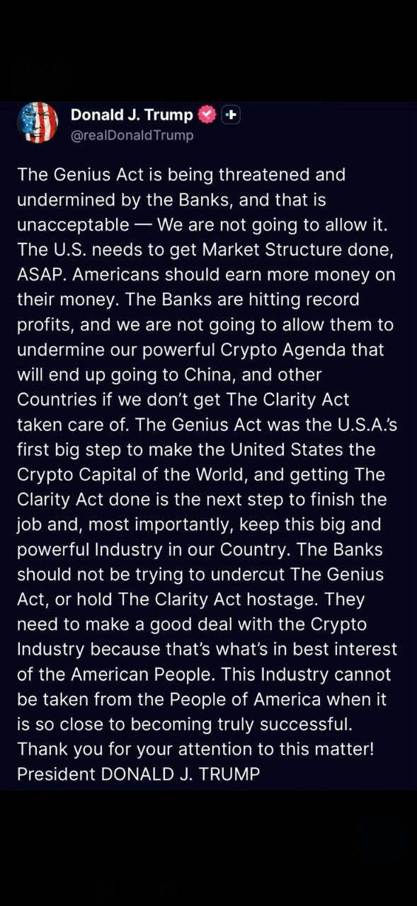

# The OCC Did Not Kill Stablecoins. It Killed Lazy Distribution

The biggest mistake people are making about the OCC’s proposed **GENIUS Act** rule is conceptual. They are reading it as a category attack.

It is not.

It is a **market-structure intervention**.

> The OCC is not signaling that stablecoins should not grow. It is signaling that stablecoins will have to grow on harder, more defensible foundations: **trust, liquidity, routing, collateral acceptance, integrations, and utility**. Comptroller **Jonathan V. Gould** said the OCC had developed a framework in which the stablecoin industry can **“flourish in a safe and sound manner,”** and that the agency wants feedback to make the final rule **effective, practical, and broadly informed by industry input**. ([**occ.treas.gov**](http://occ.treas.gov/))
> 

That is the real shift.

> **Stablecoins are not being banned. They are being professionalized.**
> 

And once that happens, one shortcut starts dying first:

> **lazy distribution.**
> 

---

## What the OCC actually changed

On **February 25, 2026**, the OCC requested comments on its proposed rule implementing the **GENIUS Act**. The proposal covers the stablecoin regulations under OCC jurisdiction, while **Bank Secrecy Act, AML, and OFAC** provisions are to be handled separately with Treasury. PwC’s summary of the proposal notes that the GENIUS framework is for “payment stablecoins,” meaning digital assets designed for payment or settlement that are redeemable at a fixed value and do not pay yield or interest. ([**pwc.com**](http://pwc.com/))

This is not prohibition language.

This is **formalization language**.

The state is saying that stablecoins are moving out of the experimental perimeter and into the regulated architecture of money movement. That is bullish for the category in one sense. But it is also more demanding, because once something becomes infrastructure, the market stops rewarding gimmicks and starts rewarding **resilience**. ([**occ.treas.gov**](http://occ.treas.gov/))

---

## The line in the sand is yield

The commercially decisive point is simple.

The OCC proposal says a permitted payment stablecoin issuer may not pay a holder **“any form of interest or yield”** solely in connection with the **holding, use, or retention** of that stablecoin. It also proposes anti-evasion treatment for affiliate and third-party structures that recreate the same economic result indirectly. PwC summarized the effect cleanly: the proposal targets payments of yield or interest, including through third-party arrangements, unless rebutted. ([**pwc.com**](http://pwc.com/))

So the regulatory message is not:

> **No stablecoins.**
> 

It is:

> **No easy growth model built on passive balance rewards and obvious pass-through workarounds.**
> 

That distinction is everything. Because once passive rewards are constrained, stablecoin growth has to go back to first principles. And first principles are much harder.

---

## Why this became a political fight

This stopped being a narrow legal debate a long time ago.

It is now a fight over:

- **deposit gravity**
- **digital dollar distribution**
- **who captures the economics of on-chain cash at scale**

Reuters reported on **March 5, 2026** that White House-brokered talks over the **Clarity Act** hit a new impasse after banks refused to back a compromise on stablecoin rewards. Reuters also reported that the White House compromise would have allowed rewards in limited cases such as **peer-to-peer payments**, but not on **idle holdings**. Banks still objected because they fear deposit flight. The same Reuters report said **Standard Chartered** estimated stablecoins could pull about **$500 billion** in deposits out of U.S. banks by the end of **2028**. ([**reuters.com**](http://reuters.com/))

That number explains almost the whole conflict.

This is not merely a debate about product design.

It is a debate about whether digital dollars become a serious rival to legacy bank funding and payments distribution. ([**reuters.com**](http://reuters.com/))

---

## Trump is not neutral. He has chosen a side.

President **Donald Trump** has now made the politics explicit.

Reuters reported that Trump accused banks of trying to **“undermine”** the bill and wrote, **“We are not going to allow them to undermine our powerful Crypto Agenda.”** The *Wall Street Journal* also reported that Trump pushed for faster movement on market structure and argued that **“Americans should earn more money on their money.”** ([**reuters.com**](http://reuters.com/))

That matters because it sharpens the real tension:

- **Trump is accelerating the category politically.**
- **The OCC is hardening the rules structurally.**

Those are different forces.

But together they point to the same outcome:

> **the category gets bigger, while the shortcut gets killed.**
> 

Washington is not moving toward “no stablecoins.”

It is moving toward **bigger stablecoins, tougher rules, and more intense competition over distribution**. ([**reuters.com**](http://reuters.com/))

---

## What the relevant industry voices are actually saying

The named voices in this fight matter because they reveal exactly where the fault lines are.

- **Jonathan V. Gould** is signaling **formalization with restraint**. Stablecoins should flourish, but inside a **safe and sound** prudential framework. ([**occ.treas.gov**](http://occ.treas.gov/))
- **Brian Armstrong**, CEO of **Coinbase**, is signaling that rewards are not a side issue. Reuters reported that Armstrong said the Senate draft would **“kill”** crypto firms’ ability to offer rewards on customer stablecoin holdings, and added, **“We’d rather have no bill than a bad bill.”** ([**reuters.com**](http://reuters.com/))
- **Summer Mersinger**, CEO of the **Blockchain Association**, told Reuters that **“the path to a workable agreement is clearer than it was a month ago.”** That is not victory language. It is tactical language. It says the industry still thinks a negotiated outcome is possible. ([**reuters.com**](http://reuters.com/))
- **Cody Carbone**, CEO of **The Digital Chamber**, praised the White House effort to bring the banking and crypto sides to the table, according to Reuters’ January 28 reporting on the talks. ([**reuters.com**](http://reuters.com/))
- **Geoff Kendrick**, Standard Chartered’s digital-asset research lead, put the banking threat in hard numbers with the **$500 billion** deposit-outflow estimate. That is why banks are fighting this so aggressively. ([**reuters.com**](http://reuters.com/))

Put those together and the picture becomes clean:

- The **OCC** wants a prudential perimeter.
- **Trump** wants crypto market structure done quickly.
- **Banks** want tighter limits on rewards.
- **Crypto firms** say rewards are tied to distribution and competition.
- **Industry groups** still think a compromise is possible. ([**reuters.com**](http://reuters.com/))

That is why this fight matters so much.

It is not about optics.

It is about **who gets to own digital dollar distribution**.

---

## The market is already a power law

Now step back and look at the actual market.

As of **March 7, 2026**, CoinMarketCap listed the total stablecoin market at about **$318.5 billion**.

### Market concentration

- **USDT**, issued by **Tether**, stood at about **$184.0 billion**
- **USDC**, issued by **Circle**, stood at about **$77.3 billion**
- Together, those two alone accounted for roughly **82 percent** of the entire stablecoin market
- **USD1**, issued by **World Liberty Financial**, stood at about **$4.59 billion**
- **PYUSD**, PayPal USD, issued by **Paxos Trust Company**, stood at about **$4.14 billion**
- **RLUSD**, Ripple USD, stood at about **$1.59 billion** and is issued by **Standard Custody & Trust Company**, a Ripple subsidiary
- **FDUSD**, issued by **First Digital**, stood at about **$373 million** ([**coinmarketcap.com**](http://coinmarketcap.com/))

Say those numbers slowly.

> **$318.5 billion total.**
> 
> 
> **$184.0 billion Tether.**
> 
> **$77.3 billion Circle.**
> 
> **Roughly 82 percent controlled by the top two.**
> 

That is not a flat market.

That is a **power-law market**. ([**coinmarketcap.com**](http://coinmarketcap.com/))

Which means new issuers are not really competing against other small issuers.

They are competing against:

- **default routing**
- **exchange liquidity**
- **wallet defaults**
- **market-maker inventory**
- **collateral eligibility**
- **institutional familiarity**

That is a much harder game.

And it means most issuers are not losing because they failed to mint a token. They are losing because they do not have a **wedge that can break routing gravity**.

---

## The big commercial consequence: this rule kills lazy distribution

This is the central commercial thesis.

> **The OCC proposal does not kill stablecoins. It kills lazy distribution.**
> 

If passive balance-based rewards are narrowed politically and regulatorily, then stablecoin growth has to revert to fundamentals:

- **trust**
- **liquidity**
- **routing**
- **collateral usefulness**
- **venue integrations**
- **utility**
- **privacy**
- **reliability under stress**

That is exactly why **EternaX** matters.

EternaX is not built around the assumption that issuers can win by paying people to park balances. It is built around the opposite assumption: in the next phase of the market, issuers will need **infrastructure-led distribution**.

That means distribution earned through:

- **safety**
- **execution quality**
- **market utility**
- **wallet integration**
- **settlement relevance**
- **collateral pathways**

So the issuer’s question changes.

Not:

> **Can I launch?**
> 

But:

> **Why will the market route to me once passive rewards stop doing the work?**
> 

That is the real question.

And that is the question EternaX is trying to answer.

---

## Post-Quantum Safety Is Not Just Security. It Is Distribution.

This is where most of the market is still behind.

In digital financial infrastructure, **post-quantum safety** is not just a cryptographic upgrade.

It is a **distribution channel**.

Because the real question is not whether someone can buy your stablecoin.

The real question is whether the market wants to **trust it, route it, warehouse it, accept it as collateral, and use it at scale over time**.

That means asking:

- Will venues list it with confidence?
- Will market makers warehouse it without hidden future migration risk?
- Will it be accepted as collateral?
- Will serious counterparties trust its long-term authorization model?
- Will wallets and applications route into it by default?
- Will the market keep using it once **post-quantum risk** becomes a priced variable?

Those are not just technical questions.

They are **distribution questions**.

And they collapse into one word:

**acceptability**.

Once the market starts to believe that a stablecoin sits on a **PQ-unsafe authorization perimeter**, the problem is no longer just theoretical cryptography.

The problem becomes commercial.

The market starts pricing in:

- future migration risk
- collateral uncertainty
- routing hesitation
- weaker institutional willingness to integrate
- lower confidence from market makers and counterparties

That is why the correct formulation is harsher than most people want to admit:

**If your $1 is not PQ-safe enough, it becomes a weaker $1.**

Not necessarily because it fails today.

But because the market begins discounting its **future trustworthiness**, and once that happens, distribution weakens before failure ever arrives.

This is exactly where **EternaX** becomes directly relevant to issuer growth.

EternaX’s core claim is not merely that it offers **post-quantum safety**.

It is that it offers **post-quantum safety at market speed**.

That distinction matters.

Because issuers do not just need a chain that can become PQ-safe eventually. They need a rail where they can issue and settle assets **without inheriting future migration debt**, **without fragmenting liquidity later**, and **without accepting the execution-quality penalty that legacy L1s may face when they retrofit PQ authorization after the fact**.

That is the difference between **PQ someday** and **PQ-native now**.

Most legacy L1s were not designed from day one around post-quantum authorization. So if PQ becomes a hard market requirement, they face a much harder path:

- retrofit complexity
- migration coordination problems
- wallet and custody disruption
- venue and liquidity fragmentation
- possible throughput and latency penalties depending on the signature scheme and implementation path

EternaX is positioned against exactly that problem.

Its claim is not simply stronger cryptography in isolation.

Its claim is **PQ-native infrastructure designed for financial markets**, where issuers need both:

- **security strong enough for the next era**
- **performance strong enough for this era**

That is the real wedge.

Because **post-quantum safety without market speed is not enough** for serious stablecoin infrastructure.

Issuers need both.

They need a rail that can protect long-term trust **and** preserve present-day usability.

For stablecoin issuers, that translates into concrete commercial advantages:

- better odds of becoming acceptable as collateral
- easier support from venues and market makers
- greater credibility with institutions and counterparties
- lower exposure to future migration discount
- stronger resilience when the market begins repricing cryptographic risk
- a better chance of becoming a routing asset, not just a nominally issued token

That is not abstract.

That is **go-to-market leverage through PQ risk quality**.

And that is why, in the next phase of **stablecoin market structure**, **post-quantum safety is not just defense**.

It is a way to improve **distribution, adoption, collateral quality, institutional confidence, and long-term routing preference**.

**The real wedge is not just PQ safety. It is PQ safety at market speed.**

---

## Safety without privacy is incomplete

For serious capital, safety is not only about authorization and settlement.

It is also about **leakage**.

Transparent rails expose flows to:

- mapping
- copying
- front-running
- adversarial intelligence
- strategic exploitation

That creates a ceiling on the quality and scale of capital willing to use the system.

This is why **EternaX’s auditable privacy** matters.

The point is not secrecy for its own sake.

The point is **auditable privacy**: privacy by default where necessary, with selective disclosure where required for compliance, audits, counterparties, and institutional assurance.

For stablecoin issuers, that matters in very practical ways:

- It makes larger flows more comfortable using the rail.
- It reduces leakage risk around treasury and market activity.
- It improves the quality of liquidity willing to participate.
- It makes the stablecoin more usable in serious financial workflows, not just retail transfers.

That matters because **high-quality liquidity does not want to be permanently exposed liquidity**.

So privacy is not a decorative feature.

For issuers, it is an **adoption lever**.

---

## Utility becomes the new distribution engine

Once passive yield is constrained, stablecoins need a different engine.

That engine is **utility-led demand**.

Stablecoins become durable when they are embedded in activity:

- **payments**
- **settlement**
- **collateral**
- **spot markets**
- **perpetuals**
- **prediction markets**
- **wallet routing**
- **treasury movement**

This is another reason **EternaX** matters.

A safer rail alone is not enough.

Issuers also need **activity surfaces**. They need places where the stablecoin is immediately used, circulated, paired, routed, and embedded in financial behavior.

That is how the market shifts from **parked-balance distribution** to **velocity-based distribution**.

And for issuers, velocity-based distribution is much more defensible because it is tied to **real usage**, not rented demand.

---

## Why EternaX Labs is built for the post-yield stablecoin era

This is the strategic conclusion.

- If the market is becoming more regulated, **trust matters more**.
- If the market is already a power law, **generic issuance matters less**.
- If passive rewards are under pressure, **utility matters more**.
- If serious capital fears leakage, **auditable privacy matters more**.
- If acceptability and execution quality become priced variables, **the stronger rail gains routing advantage**.

That is the environment **EternaX** is built for.

For issuers, the value proposition is clear:

- safer infrastructure improves **trust and collateral acceptance**
- auditable privacy improves **institutional willingness to use the asset**
- real market utility improves **transaction velocity and embedded adoption**
- better execution conditions improve the odds that the stablecoin becomes a **routing asset**, not just a nominally issued token**

That is what post-yield competition looks like.

Not **rewards versus rewards**.

> **Infrastructure versus irrelevance.**
> 

---

## The real takeaway

Trump has made the politics explicit.

Jonathan Gould has made the regulatory direction explicit.

Brian Armstrong has made the distribution stakes explicit.

Geoff Kendrick has quantified the banking threat.

Summer Mersinger and Cody Carbone have made clear that the industry still sees a path to compromise. ([**reuters.com**](http://reuters.com/))

So the category is not shrinking.

It is **hardening**.

Stablecoins are being legitimized, but the market is being pushed away from easy rewards-led acquisition and toward:

- **trust**
- **utility**
- **routing**
- **privacy**
- **infrastructure quality** ([**pwc.com**](http://pwc.com/))

**The old playbook**

- **issue**
- **incentivize**
- **subsidize**
- **market**
- **repeat**

**The new playbook**

- **build trust**
- **earn integrations**
- **secure liquidity**
- **preserve execution quality**
- **enable privacy where needed**
- **create real utility**

That is why the OCC’s **GENIUS Act** proposal matters.

It accelerates the shift from:

- **incentive-led growth** to **infrastructure-led growth**
- **yield theater** to **trust, utility, and routing**
- **token marketing** to **stablecoin market structure**
- **lazy distribution** to **earned distribution** ([**pwc.com**](http://pwc.com/))

And that is exactly why **EternaX** is strategically relevant now.

Because in the **post-yield stablecoin era**, issuers will not win by merely existing.

They will win by issuing on rails that make them:

- **safer**
- **more acceptable**
- **more usable**
- **more private where needed**
- **more deeply integrated into actual financial activity**

> **That is the game now.**
> 

[**EternaX Labs**](https://www.linkedin.com/company/eternax-labs/) *is a post-quantum, market-speed blockchain built for stablecoins, tokenized cash, RWAs, and high-velocity on-chain markets. Its core advantage is a [protocol-native novel post-quantum scheme](../silmarils-post-quantum-authentication-without-size-tax/index.html) designed to keep real markets fast while upgrading authorization security. In EternaX materials, the PQ signature size is 160 bytes, targeting low single-digit overhead and ~120ms spendable finality, rather than accepting Falcon-class throughput haircuts that can compress TPS, raise fees, and degrade liquidity. EternaX also provides auditable privacy (selective disclosure with verifiable controls) so serious flows can move with transparency where required and confidentiality where necessary. For issuers and investors, the wedge is direct: mint PQ-native stablecoins day one, avoid future perimeter-migration and liquidity-fracture risk, and scale on rails engineered for speed, security, and continuity. For more details, contact [**info@eternax.ai**](mailto:info@eternax.ai).*