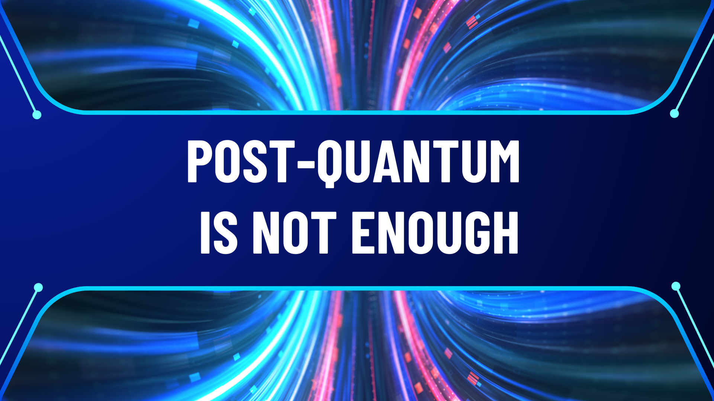
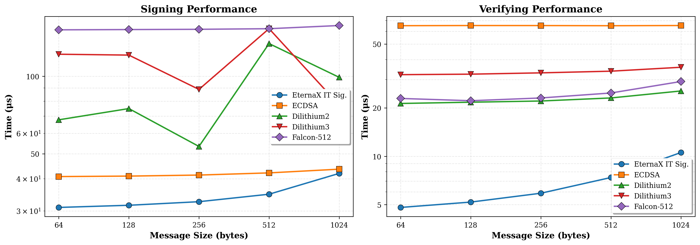

# Post-Quantum Is Not Enough

How to secure financial infrastructure in the world of AI and quantum computers

## The bet

Every blockchain in production today rests on the same foundation: the belief that certain mathematical problems are hard to solve. Bitcoin uses ECDSA over secp256k1, Ethereum uses the same for externally owned accounts, and every other blockchain in production uses a variant of elliptic curve cryptography. Every transaction a user sends, every block a validator signs, every attestation in the consensus protocol depends on one assumption: that no one can efficiently compute a discrete logarithm on an elliptic curve.

This assumption has held for roughly 40 years. In cryptography, 40 years is both a long time and not very long at all. The Enigma cipher, which Nazi Germany considered unbreakable, lasted about 15 years before Polish and British mathematicians found systematic ways to defeat it. The knapsack-based public key cryptosystem proposed by Merkle and Hellman in 1978 was broken by Shamir in 1984. More recently, SIDH, a promising post-quantum scheme based on supersingular isogenies, was catastrophically broken in 2022 by a single paper, years after it had been a NIST post-quantum candidate.

The pattern is consistent: cryptographic schemes built on structured mathematical problems eventually meet the algorithm that exploits that structure. The only question is when.

## The blind spot

The blockchain industry has been preparing for one specific version of this threat: quantum computers. The story is well known. A sufficiently large quantum computer running Shor’s algorithm can solve the discrete logarithm problem in polynomial time, breaking ECC along with RSA and most of the public-key cryptography deployed today. NIST has responded by standardizing schemes designed to resist attacks from quantum hardware: ML-DSA/Dilithium (based on lattice problems), FN-DSA/Falcon (also lattice-based), SLH-DSA/SPHINCS+ (based on hash functions).

This is important work. But there is a different threat vector that receives less attention.

Justin Drake, a researcher at the Ethereum Foundation, articulated it clearly on the Unchained podcast:

> “The current elliptic curves that we have use the so-called discrete log assumption, and it is possible that a non-quantum computer, a so-called classical computer, could break these things. And the reason is that there’s a lot of structure in these elliptic curves, and you could imagine some sort of mathematical breakthrough to happen. Now traditionally, these mathematical breakthroughs have happened by humans, by mathematicians, over periods of decades. But what we’re seeing with AI is that time is shrinking, and we’re starting to potentially see AI being much better than humans at mathematics. And so maybe they can find these kind of clever breakthroughs that leverage the structure of elliptic curves within a similar timeline or a shorter timeline than that of quantum computers. So this migration to post-quantum cryptography is also a migration to post-AI cryptography.”
> 

The point is subtle but important. The discrete logarithm problem has no proven lower bound on its computational complexity. We believe it is hard because decades of effort by talented mathematicians have not produced a fast algorithm. But “decades of human effort” is a weaker guarantee than it used to be. AI systems like DeepMind’s AlphaGeometry and FunSearch have demonstrated that machines can discover novel mathematical results, find new constructions and proofs that humans had missed. These are early results and the capabilities are advancing rapidly.

A classical algorithmic breakthrough for the discrete logarithm problem would not require building a quantum computer. It would require one good idea, possibly found by a system that can explore the mathematical landscape faster and more broadly than any human team. And unlike a quantum computer, which announces itself through years of engineering progress, an algorithmic breakthrough can appear in a single paper.

## Structure as attack surface

The reason Drake specifically mentions “structure in elliptic curves” is that structure is what makes algorithmic breakthroughs possible. Elliptic curves are rich mathematical objects. They carry a group law, endomorphism rings, pairings between curves, and deep connections to algebraic number theory. Each of these properties is a potential entry point for a new algorithm. The index calculus method, which efficiently solves the discrete log in multiplicative groups of finite fields, works precisely because it can exploit the factorization structure of those groups. Elliptic curves have resisted analogous attacks so far, but the structure is there, waiting.

Lattice-based cryptography, which forms the basis of Dilithium and Falcon, also carries algebraic structure. The hard problems (Learning With Errors, Ring-LWE) live in lattices over polynomial rings. There is an active research community probing this structure, and while no devastating attack has appeared, the Ethereum Foundation has taken note. Their preference for hash-based post-quantum schemes over lattice-based ones reflects a deliberate choice to minimize the algebraic surface area available to future attackers.

Hash-based signatures like SPHINCS+ sit at the conservative end of this spectrum. Their security reduces to the assumption that hash functions like SHA-256 are one-way, that you cannot efficiently find an input that produces a given output. Hash functions are designed to be structureless, to behave as much like random oracles as possible. There is very little algebraic handle for an algorithm to grab. This makes hash-based schemes the most conservative computational choice available.

But they are still computational. The security of SPHINCS+ depends on SHA-256 being hard to invert. If that assumption fails (and “never” is a strong word in cryptography), the scheme fails with it.

## Removing the assumption

There is a category of cryptographic security that does not depend on computational hardness at all. Information-theoretic security means that a scheme cannot be broken even by an adversary with unlimited computational power. Not “infeasible to break” but “mathematically impossible to break,” because the information required to break it simply is not available to the attacker.

The concept is not new. The one-time pad, described by Claude Shannon in 1949, provides information-theoretic secrecy: a ciphertext encrypted with a truly random key of equal length reveals nothing about the plaintext, regardless of how much computation the adversary performs. The limitation of the one-time pad is the need for a pre-shared key as long as the message, which kept it impractical for most applications. Authenticated codes (MACs) based on universal hashing provide information-theoretic authentication, but only between parties who share a secret key, with no way for a third party to verify.

EternaX uses an information-theoretic signature scheme designed for high performance blockchain operations. When a user submits a transaction to a blockchain, it travels over a TLS connection to a validator or RPC node. TLS establishes a shared secret between the two parties as part of its handshake. This happens before any transaction data is exchanged and is a fundamental part of how the internet works. EternaX uses this shared secret as the channel key for its information-theoretic construction. The validator verifies the signature using the shared channel key, includes the transaction in a block with a publicly verifiable receipt. 

We have chosen an information-theoretic signature, because the unforgeability of this class does not reduce to any computational problem or hardness assumption. The signature encodes a system of equations over a finite field with more unknowns than constraints, leaving a full degree of freedom in the solution space. From the attacker’s perspective, the critical verification value is uniformly distributed over all possible values, regardless of what the attacker computes. The probability of a successful forgery is exactly 1/p, where p is the size of the field (approximately 2^255). This bound holds against classical computers, quantum computers, AI-discovered algorithms, and any combination thereof.

The threat landscape, viewed through this lens:

| Threat scenario | ECC | Lattice PQC | Hash-based PQC | [EternaX novel PQ scheme](../silmarils-post-quantum-authentication-without-size-tax/index.html) |
| --- | --- | --- | --- | --- |
| Known classical algorithms | Safe | Safe | Safe | Safe |
| AI-discovered classical breakthrough | Breaks | At risk | Safe | Safe |
| Quantum computer (Shor’s algorithm) | Breaks | Believed safe | Safe | Safe |
| AI + quantum combined | Breaks | Uncertain | Likely safe | Safe |
| Unbounded adversary | Breaks | Breaks | Breaks | Safe |

## Size and performance

Post-quantum migration has a cost problem. The NIST-standardized schemes produce signatures that are dramatically larger than ECC:

| Scheme | Signature size | Public key size | Security basis |
| --- | --- | --- | --- |
| ECDSA (secp256k1) | 64 bytes | 33 bytes | Elliptic curve (not PQ-safe) |
| [EternaX PQ novel scheme](../silmarils-post-quantum-authentication-without-size-tax/index.html) | 160 bytes | 64 bytes | Information-theoretic |
| Dilithium2 | 2,420 bytes | 1,312 bytes | Lattice |
| Falcon-512 | 666 bytes | 897 bytes | Lattice |
| SPHINCS+-128s | 7,856 bytes | 32 bytes | Hash-based |

Transaction signatures are the most numerous cryptographic objects on a blockchain. They account for a large share of block space, network bandwidth, and verification cost. Eternax’s IT-signature is 160 bytes, about 2.5x the size of ECDSA, but >4x times smaller than the most compact NIST post-quantum standard and ~60 times smaller than the most conservative one. Verification requires a small number of field multiplications and additions, comparable in cost to ECC verification and an order of magnitude cheaper than lattice or hash-based alternatives.

For a blockchain processing thousands of transactions per second, the difference between 64-byte and 2,420-byte signatures is not a rounding error. It determines whether post-quantum migration is a seamless upgrade or a scalability regression that forces architectural compromises.

## A different kind of migration

The blockchain industry will need to move away from elliptic curve cryptography. Whether the forcing function is a quantum computer, an AI-discovered algorithm, or a human mathematical breakthrough, the current foundation is not permanent. The only open questions are when and what to migrate to.

The standard answer is lattice-based or hash-based schemes that are believed to resist quantum attacks. This is a reasonable default, and for many applications it may be the only option.

But for blockchains, where secure connections between users and nodes are universal, where validators naturally serve as verifiers, and where signature size directly impacts scalability, there is a stronger option. Information-theoretic signatures make no bet on the hardness of any mathematical problem. They require no future migration when the next algorithmic surprise arrives, because their security does not depend on the absence of algorithmic surprises. It depends on the secrecy of a channel key that is established by the infrastructure every blockchain relies on.

Post-quantum is a necessary step. It is not the last one.

**Connect: [info@eternax.ai](mailto:info@eternax.ai)**

*EternaX is a high-performance, post-quantum cryptography (PQC) native settlement rail built to become the default home for minting new dollars onchain: stablecoins, tokenized treasuries, and tokenized RWAs. The issuer reality is simple: mint on legacy ECDSA and EdDSA rails and you embed migration debt that gets called under stress through selective key compromise, depegs, collateral haircuts, and liquidity fragmentation. EternaX’s wedge is PQ-native authorization from day one with a [novel post-quantum signature design](../silmarils-post-quantum-authentication-without-size-tax/index.html) that is engineered for market throughput and delivers signatures about 4x smaller than next best, avoiding the throughput and ecosystem coordination cliffs of retrofit PQC. With auditable privacy, sub-second finality targets (~120ms), prediction markets live, and spot plus perps next, EternaX unifies issuance and market venues on one PQ-secured rail. Adoption compounds through two paths: canonical PQ-native issuance for new assets and a 1:1 lock-and-mint migration-to-safety route for legacy liquidity into PQ-secured settlement.*

*See full details of the [EternaX novel digital signature](../silmarils-post-quantum-authentication-without-size-tax/index.html).*