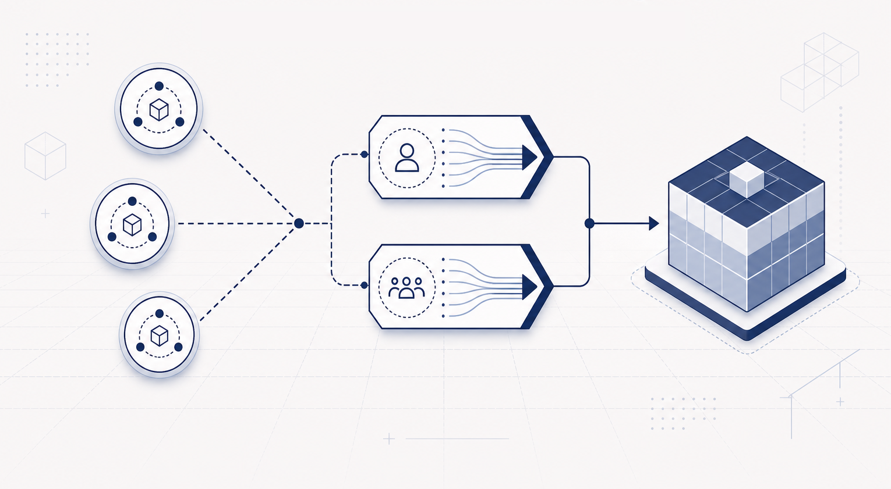

# Post-Quantum MPC Custody, On-Chain: Thresholding Authorization with Hash-Based Signatures

The clearest recent statement of a real problem in post-quantum custody comes from Taurus. Their June 2026 report, *[Quantum Computing Risk in Digital Asset Custody: HSM vs. MPC](https://www.taurushq.com/reports/quantum-computing-risk-in-digital-asset-custody-hsm-vs-mpc/)*, makes a point that is easy to miss in the broader post-quantum conversation and that we think is right: MPC custody has a structural problem in the post-quantum transition, and for the most conservative signature family the problem is not just engineering maturity.

For the market-level version of the problem, see our companion analysis, *[The Post-Quantum Institutional MPC Custody Crisis 2026](https://eternax.ai/post_quantum_mpc_custody_crisis_hash_based_sphincs_institutional.html)*. This note is a technical approach to what a custody provider can do if its product depends on distributed approval today, but the post-quantum signature family it trusts most cannot be threshold-signed like ECDSA.

Hash-based signatures (SLH-DSA/SPHINCS+, LMS/HSS) do not have the algebraic structure that makes threshold ECDSA possible. To threshold-sign them, a protocol has to evaluate the hash-based signing computation inside MPC. The MPTS 2026 result of Kondi, Kumar, and Vanegas, *[Black-Box Threshold Signing of Hash-Based Signatures is Expensive](https://csrc.nist.gov/csrc/media/presentations/2026/mpts2026-4b4/images-media/mpts2026-4b4-slides-bbts-hbs-kumar.pdf)*, makes the black-box version of that barrier precise. What remains is either non-black-box MPC for a large hash-based computation, or setup assumptions that reintroduce a party everyone has to trust. Neither is an obvious product path for an institutional custodian whose core promise is no single point of compromise.

We agree with that conclusion. The useful question is what we can do once we accept it: preserve distributed custody authorization without asking custody providers to become cryptography labs trying to threshold SPHINCS+.

## The Solution: Do Not Threshold The Signature

Given the signature cannot be thresholded cleanly, we do not make the signature carry the threshold.

Instead, we make custody authorization an on-chain validity rule with two coupled gates over the same canonical operation. On a native post-quantum rail, this can be a consensus rule. On Ethereum-like systems, it can be an account, vault, token-control, bridge, or issuer-module rule for assets whose control path is moved into that contract.

1. **Member authentication.** Each approving custody member signs its own contribution envelope with a registered SLH-DSA key. This is not a threshold hash-based signature, but a per-member attribution for the share that member submitted.
2. **Threshold authorization.** The chain reconstructs a SILMARILS-style ([arXiv:2605.03230](https://arxiv.org/abs/2605.03230)) affine authorization value from the authenticated shares of a quorum of custody members. This is the distributed gate that says enough custody parties approved this exact operation.

Funds move only when both gates pass. The member signatures bind the message, policy, nonce, member identity, authorization commitment, and affine evaluation share. The threshold gate then checks that the signed shares decode into one authorization value for the same operation.

The core point of this design: the hash-based signatures authenticate custody-member contributions, while the threshold property lives in a parallel algebraic authorization layer. The design does not challenge the impossibility of thresholding hash-based signatures. It routes around it by thresholding authorization instead.

## Why Not Just “Collect enough signatures”

A plain t-of-n SLH-DSA multisig would be straightforward, but it would also be a fairly boring endpoint: collect large post-quantum signatures and count them. That may be useful, but it does not give custody providers much of an MPC analogue beyond quorum counting.

The more interesting path is to keep the quorum as an affine authorization state. Each custody member holds a share of per-operation coefficients generated through VSS, AVSS, or joint random secret sharing. For a given operation, the member computes one field evaluation locally:

`share = k1_share * x + k2_share`

where `x` is derived from the operation and, in the richer profile, from a SILMARILS linear-extract view over member approvals. The chain verifies the member’s SLH-DSA envelope, checks or robustly decodes the evaluation shares, reconstructs the authorization value, and consumes the coefficient id so the same affine state is never evaluated twice.

This preserves the custody property people actually turn to MPC for: below threshold, shares reveal nothing useful about the authorization secret. At threshold, the operation can be authorized. Validators can verify the result, but they never hold custody shares and cannot produce the gate themselves.

## What Custodians Can Use It For

The first useful surfaces are rare, high-value operations where custody policy already dominates:

- stablecoin mint and burn authorization;
- tokenized fund or treasury movements;
- bridge and settlement-venue admin controls;
- institutional vault withdrawals;
- custody-set rotation, key rotation, and policy changes;
- post-quantum account control for assets issued on a PQ-native rail.

These are the operations where large admission-time post-quantum signatures are acceptable, audit evidence matters, and preserving a distributed approval boundary is more important than minimizing every byte of permanent ledger state.

## Authorization Layer Design

SILMARILS is useful here for its information-checking core being linear over a prime field. The conservative profile uses that as an affine authorization check: all approving members evaluate shares against the same operation-derived scalar, and the chain reconstructs the result.

The richer profile is the interesting research direction. Full SILMARILS approvals are per-member objects, not pieces of one common signature tuple. A `LinExtract` profile can first verify each member’s SILMARILS approval, extract a field element from each, and then combine those field elements with public weights into a linear view. That derived view becomes part of the custody scalar `x`.

There is an important boundary: SILMARILS designated-verifier transcripts are intentionally simulatable. They are not the member-level non-repudiation layer. Member attribution comes from the SLH-DSA envelope that signs the SILMARILS object hash and the affine share. SLH-DSA supplies per-member attribution; SILMARILS supplies the algebraic authorization machinery and compact linear receipts.

The security claim is correspondingly scoped. The affine forgery bound is information-theoretic; the deployed system also relies on SLH-DSA unforgeability, BFT finality, authenticated setup channels, and the selected VSS/AVSS/JRSS assumptions.

## Evidence And Storage

Custody operations are rare and high value: withdrawals, mint/burn controls, key rotation, delegation, treasury moves. They can afford large admission-time SLH-DSA checks. 

The intended model separates validation from evidence retention:

- verify member SLH-DSA signatures and affine shares during admission;
- finalize the operation under BFT consensus;
- keep a compact on-chain custody receipt: policy id, nonce, coefficient id, profile id, member bitmap or count, transcript hash, reconstructed authorization value, and finality evidence;
- let the custodian, auditor, or issuer choose the evidence-retention profile: full admission transcript, raw member signatures, SILMARILS objects, openings, Merkle-rooted archive, or compact receipt only.

For regulated custody, retaining the full admission transcript may be the right default. For lighter deployments, the permanent public ledger can keep only the compact receipt and transcript hash, with third parties relying on finality for gate acceptance unless the archive is disclosed. That is an evidence-policy choice.

## Rail, Not Custodian

EternaX is not a custodian and does not presently intend to become one. The custodian still runs the regulated custody business: member operations, policy engines, recovery, key rotation, audits, customer relationships, and compliance workflows.

The point is to give those custodians an enforcement rail where their distributed-approval model can survive the post-quantum transition without pretending that hash-based signatures can be threshold-signed like elliptic curves. This does not require the custodian to become an L1, abandon its policy engine, or replace its customer-facing custody workflow. The rail or contract layer enforces the post-quantum authorization gate.

The native EternaX deployment makes both gates: SLH-DSA member authentication and affine threshold authorization, become consensus-level block validity conditions. Validators reject custody operations that fail either gate. That is the cleanest version of the design: no contract gas accounting, no account-abstraction indirection, and no dependence on a host chain exposing the right post-quantum verification primitives.

While it is not a transparent retrofit onto Ethereum's native account validity, Bitcoin's script validity, or arbitrary existing accounts, a version can be enforced by smart-contract wallets, vaults, token issuer modules, stablecoin mint/burn controllers, bridge controllers, or ERC-4337-style smart accounts for assets whose control path is moved into that contract.

If Ethereum or another L1 adds post-quantum EOA authentication, PQ signature precompiles, or an account-abstraction path with usable PQ verification, gate 1 becomes much easier to implement in-contract or through native sender authentication. Gate 2 is naturally contract-shaped for small custody quorums: field arithmetic, share checking or robust decoding, reconstruction, and coefficient-id consumption. The hard parts are signature verification cost, calldata, evidence retention, and a concrete VSS/AVSS/JRSS profile acceptable to regulated custodians.

The boundaries are important. This is not a threshold SLH-DSA signature and not a transparent retrofit to arbitrary existing protocols. It is also not just "count t signatures": the long-term direction is a custody authorization layer that keeps the algebraic shape of MPC approval flows with shares, refresh, transcript roots, policy-bound nonces, and compact receipts; while using standardized hash-based signatures.

## Outlook

The HSM-versus-MPC framing assumes custody has to choose between a hardware boundary that is hard to distribute and a threshold-signature model that loses its cleanest path in the post-quantum world. A native dual gate gives a third shape: conservative post-quantum member authentication next to distributed authorization that the chain can enforce.

That is the opening for custody providers. They do not need to become cryptography labs trying to threshold SPHINCS+. They can bring their operating model with distributed approvals, recovery, policy controls, audit, and regulated workflows; to assets issued on a post-quantum-native rail or to contract-controlled assets where the custody gate can be enforced.

We are designing the authorization gate against how custodians operate in practice: small thresholds, share refresh, evidence retention, policy rotation, and provider-grade audit views. We are looking for custody, HSM, MPC, issuer teams to pressure-test three things: workflow fit, evidence-retention requirements, and the minimal VSS/AVSS/JRSS profile acceptable for regulated operations. If you want a post-quantum custody path that keeps distributed authorization without threshold-signing hash-based signatures, we should talk.

**Connect: [info@eternax.ai](mailto:info@eternax.ai)**

*EternaX is a high-performance, post-quantum cryptography (PQC) native settlement rail built to become the default home for minting new dollars onchain: stablecoins, tokenized treasuries, and tokenized RWAs. The issuer reality is simple: mint on legacy ECDSA and EdDSA rails and you embed migration debt that gets called under stress through selective key compromise, depegs, collateral haircuts, and liquidity fragmentation. EternaX's wedge is PQ-native authorization from day one with a [novel post-quantum signature design](../silmarils-post-quantum-authentication-without-size-tax/index.html) that is engineered for market throughput and delivers signatures about 4x smaller than next best at >50 000 TPS, avoiding the throughput and ecosystem coordination cliffs of retrofit PQC. With auditable privacy, sub-second finality targets, prediction markets live, and spot plus perps next, EternaX unifies issuance and market venues on one PQ-secured rail.* 