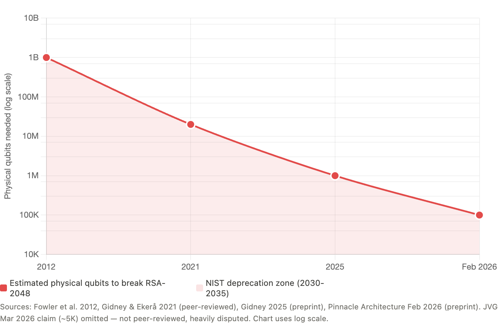
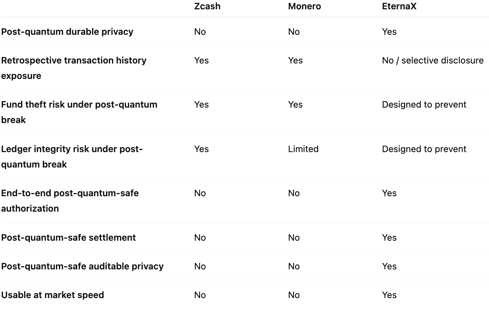
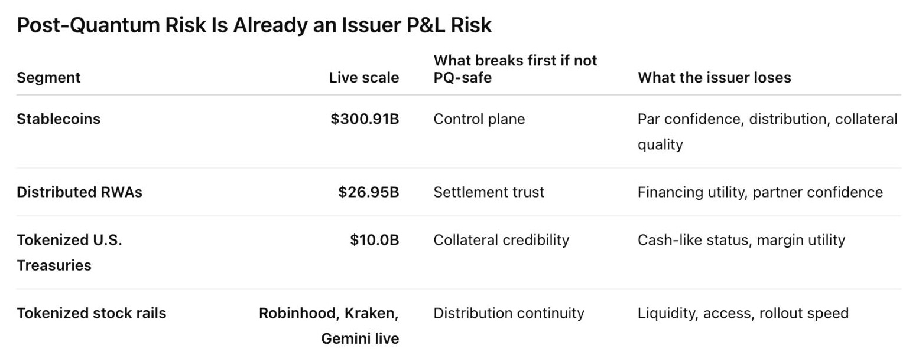

# Private Chains Are Neither Private Nor Post Quantum Safe

### **Why Zcash and Monero Fail the Post-Quantum Test. Why This Is Now a Day-One Decision for Stablecoin, RWA, Tokenized Fund, and Tokenized Equity Issuers. And Why We Are Building EternaX for a Post-Quantum World**

.png)

### **TL;DR**

The wrong standard is “hidden = safe.” Privacy is not a block-explorer property. It is a cryptographic property. The real question is whether a chain’s authorization, privacy, and settlement assumptions remain durable if the relevant elliptic-curve assumptions become practically breakable. On that standard, the conclusion is clear: Zcash and Monero are not end-to-end post-quantum safe today, and legacy privacy is not the same thing as durable privacy. ([Zcash](https://zips.z.cash/zip-2005))

The failure modes are different, but the market lesson is the same. Zcash’s own ZIP 2005 says that if those attacks became practical, an adversary could steal users’ funds, cause arbitrary inflation, and break the Balance property. Monero’s own post-quantum CCS proposal says that a quantum adversary with a public wallet address could derive the private key, recover the user’s entire past and subsequent transaction history, and steal current or future funds. In plain English: for Zcash, the stronger case is privacy failure plus theft plus integrity failure. For Monero, it is retrospective deanonymization plus spend linkage plus theft. ([Zcash](https://zips.z.cash/zip-2005))

This is no longer just a privacy-coin debate. It is now an issuer and market-infrastructure decision. As of March 2026, [RWA.xyz](http://rwa.xyz/) shows about $300.91B in stablecoin value [Paxos](https://www.linkedin.com/company/paxos/) [Tether.io BitGo-us](https://www.linkedin.com/preload/#) , about $26.95B in distributed asset value, and about $10.00B in tokenized U.S. Treasuries. Reuters has also reported that [Robinhood Robinhood Ventures](https://www.linkedin.com/preload/#) , [Kraken](https://www.linkedin.com/preload/#) , and [Gemini](https://www.linkedin.com/preload/#) have launched tokenized stock offerings in Europe, while [BlackRock](https://www.linkedin.com/preload/#) and [Franklin Templeton Fidelity Investments Swift NYSE ICE Anchorage Digital. Securitize Centrifuge CME Group Nasdaq Cboe Global Markets The Depository Trust & Clearing Corporation (DTCC) Citadel Securities BNP Paribas](https://www.linkedin.com/preload/#) offer tokenized Treasury products. ([RWA.xyz](http://rwa.xyz/))

That changes the standard. If mint, burn, transfer, treasury controls, compliance actions, privacy, and settlement still depend on legacy assumptions, the asset is carrying future migration debt inside its own control plane. U.S. regulators are already formalizing the rails underneath this market: the OCC has proposed rules to implement the GENIUS Act framework for payment stablecoin issuers, the federal banking agencies have said eligible tokenized securities generally receive the same capital treatment as their non-tokenized equivalents, and SEC staff said they would not object to broker-dealers applying a 2% haircut to proprietary positions in qualifying payment stablecoins. ([Reuters](https://www.reuters.com/legal/government/us-regulators-say-banks-wont-face-extra-capital-charges-tokenized-securities-2026-03-05/))

That is why the answer is not just post-quantum-safe assets. The answer is post-quantum-safe authorization, post-quantum-safe settlement, and post-quantum-safe auditable privacy, without sacrificing market speed. That is the standard [EternaX Labs](https://www.linkedin.com/preload/#) is build for.

> Private for now is not private enough.
> 

## The wrong standard

One of the biggest mistakes in crypto is confusing hidden with safe. If an address is obscured, the graph looks unreadable, or balances are hard to inspect, many conclude the system is durably private. I think that is the wrong standard. Privacy is not a block-explorer property. It is a cryptographic property. The real question is: what assumptions are making this private, and what happens if those assumptions fail later?

This article does not claim that practical quantum attacks on Zcash or Monero exist today. It is a conditional, first-party scenario analysis: if the relevant elliptic-curve assumptions became practically breakable, what do the projects’ own materials say would happen to privacy, ownership, and ledger integrity? The strongest claims below rely first on formal protocol materials where they exist, then on official documentation, and only then on first-party research materials where that is the best evidence available. ([Zcash](https://zips.z.cash/zip-2005))

## Misconceptions

**Misconception 1:** “If the address is hidden, the system is private enough.” Wrong. Hidden is not the same as secure. Zcash’s own ZIP 2005 says the proposed Orchard recoverability change “does not by itself make the protocol secure against quantum adversaries.” Shielded presentation is not the same as post-quantum safety. ([Zcash](https://zips.z.cash/zip-2005))

**Misconception 2:** “If quantum matters, it only affects future transactions.” Wrong. Monero’s post-quantum CCS proposal says a quantum adversary who has obtained a public wallet address can derive the private key, learn the user’s entire past and subsequent transaction history, and steal current or future funds. That is not just a future-privacy problem. It is a retrospective-history problem. ([Community Crowdfunding System](https://ccs.getmonero.org/proposals/research-post-quantum-monero.html))

**Misconception 3:** “This is only a privacy issue.” Wrong. Zcash’s own materials tie the risk to theft, inflation, and Balance failure. Monero’s own post-quantum proposal ties the risk to theft of current or future funds. This is a fund-safety problem, not just an information-exposure problem. ([Zcash](https://zips.z.cash/zip-2005))

**Misconception 4:** “We can patch this later.” Wrong. Zcash’s recoverability proposal exists precisely because “patch later” is not clean once break conditions arrive. ZIP 2005 makes clear that recoverability is only a partial step, not full quantum security, and that migration and retained recovery material determine whether users can keep access to funds if current components must be disabled. ([Zcash](https://zips.z.cash/zip-2005))

**Misconception 5:** “Zcash and Monero are already post-quantum-safe chains.”Wrong. At best, there are partial resilience measures or partially resistant components. That is not the same as saying either chain is end-to-end post-quantum safe today. Zcash’s own ZIP 2005 explicitly says the proposal does not by itself make the protocol secure against quantum adversaries and even lists addressing quantum attacks on privacy as a non-requirement of that proposal. Monero’s CCS proposal similarly notes that some current features may retain resistance, but also says a quantum adversary with a public wallet address could derive the private key, recover transaction history, and steal funds. In other words, partial resilience is not the same as durable, end-to-end post-quantum safety. ([Zcash](https://zips.z.cash/zip-2005))

## Zcash is the clearest first-party warning

Zcash’s official record is unusually explicit. ZIP 2005 says that if attacks allowing discrete logarithms on the elliptic curves used in Zcash became practical, an adversary could cause arbitrary inflation or steal users’ funds. The same document says the Sapling and Orchard note commitment algorithms are not post-quantum binding, meaning a quantum or discrete-log-breaking adversary could forge and spend notes not actually in the commitment tree, breaking the Balance property. It also says the recoverability proposal “does not by itself make the protocol secure against quantum adversaries.” ([Zcash](https://zips.z.cash/zip-2005))

That is not a narrow privacy problem. It is a stacked risk surface: confidentiality risk, ownership risk, and ledger-integrity risk. Zcash’s own materials also make clear that shielded privacy sits on cryptographic machinery it is already analyzing in quantum terms. ZIP 212 says the newer note plaintext format lets recipients verify that the sender knows the private key corresponding to the ephemeral Diffie-Hellman key, and explains the sender-side ephemeral secret and shared Diffie-Hellman secret in the payment flow. ([Zcash](https://zips.z.cash/zip-2005))

So the right framing for Zcash is simple: if the relevant elliptic-curve assumptions fail, privacy, ownership, and Balance can all come under pressure at once. ([Zcash](https://zips.z.cash/zip-2005))

## Monero is different. It is not safer in the way that matters.

Monero’s architecture is not the same as Zcash’s. That matters. But it does not rescue the system from the core argument. Monero’s official FAQ says privacy comes from ring signatures, RingCT, and stealth addresses, and that all transactions on the network are private by mandate. Those mechanisms hide sender ambiguity, amounts, and receiver identity today. ([getmonero.org](http://getmonero.org/)[, The Monero Project](https://www.getmonero.org/get-started/faq/))

Its post-quantum CCS proposal then says that a quantum adversary who obtains a public wallet address can derive the private key, learn the user’s entire past and subsequent transaction history, and steal current or future funds. It also says a quantum adversary can derive private keys from key images, breaking privacy features for already-recorded transactions, and can deobfuscate the transaction graph. ([Community Crowdfunding System](https://ccs.getmonero.org/proposals/research-post-quantum-monero.html))

So Monero is not best described as a narrow “harvest now, decrypt later” case. A more precise description is: archive now, solve later, deanonymize later, steal later. The evidence base here is not as formal as Zcash’s ZIP process. It relies on Monero’s official documentation plus first-party research materials. But the direction of the risk is still clear. ([getmonero.org](http://getmonero.org/)[, The Monero Project](https://www.getmonero.org/get-started/faq/))

## The Attack-Cost Curve Is Compressing  

Five years ago, RSA-2048 break estimates sat near 20 million noisy qubits. By 2025, that fell below 1 million under stated assumptions. By February 2026, serious architecture work was arguing for sub-100,000 physical qubits. And by March, even more aggressive claims entered the conversation. Whether every new claim survives scrutiny is not the point. The point is that the security margin around RSA and ECC is compressing faster than institutional migration plans were built for.

## If the Quantum adversaries existed today, what would Zcash and Monero users actually face?

For Zcash, the answer is severe.

If the relevant discrete-log assumptions became practically breakable, ZIP 2005 indicates the risk is not limited to privacy exposure. The failure surface includes:

- theft of users’ funds
- arbitrary inflation
- forged notes
- broken Balance guarantees
- compromised trust in the ledger itself

In practical terms, that means private-history exposure plus ownership risk plus integrity failure.

For Monero, the shape is different, but the outcome is still brutal.

Its post-quantum proposal indicates that a quantum adversary with a public wallet address could derive the private key, recover past and future transaction history, and steal current or future funds. Combined with the discussion around key images and one-time keys, the practical picture is:

- retrospective deanonymization
- stronger spend linkage
- graph deobfuscation
- theft

So the honest summary is this:

Zcash: privacy failure plus theft, forgery, inflation, and Balance failure. Monero: retrospective deanonymization plus transaction-history recovery plus spend linkage plus theft. That is why the downside is not “some old private data might leak.” The downside is worse. Private history can become exposed. Control over funds can become unsafe. In some systems, ledger integrity itself can come into question.

## The real distinction is false privacy vs durable privacy

False privacy looks private now but carries delayed failure inside the design. Once the underlying assumptions fail, the system moves from hidden to exposed, and in some cases from private to impaired.

Durable privacy means the privacy model itself is built for the threat model that matters tomorrow. It is not enough for the asset layer to upgrade while the privacy layer still carries archive-now, solve-later exposure. The deeper lesson from Zcash and Monero is not that their engineering was weak. It is that privacy which depends on assumptions later broken by quantum capability is not durable privacy. ([Zcash](https://zips.z.cash/zip-2005))

## This is now an stablecoin, an RWA, a tokenized fund, or tokenized equity, issuer decision, not a theory debate

As of March 14, 2026, [RWA.xyz](http://rwa.xyz/) shows about $300.94B in stablecoin value and $26.92B in distributed real-world assets. Reuters also reported last week that [Robinhood](https://www.linkedin.com/preload/#) , [Kraken](https://www.linkedin.com/preload/#) , and [Gemini](https://www.linkedin.com/preload/#) had launched tokenized stock offerings in Europe, while [BlackRock](https://www.linkedin.com/preload/#) and [Franklin Templeton Fidelity Investments](https://www.linkedin.com/preload/#) offer tokenized Treasury products. ([RWA.xyz](http://rwa.xyz/))

If you are issuing a stablecoin, an RWA, a tokenized fund, or tokenized equity, you are no longer just choosing a chain. You are choosing your future authorization risk, privacy risk, settlement risk, and migration burden. And regulators are increasingly formalizing the rails underneath that choice. The OCC says the GENIUS Act establishes a regulatory framework for payment stablecoin activities and generally prohibits any person other than a permitted payment stablecoin issuer from issuing a payment stablecoin in the United States. The federal banking agencies say eligible tokenized securities should generally receive the same capital treatment as the non-tokenized form, and that the capital rule is technology neutral. SEC staff said they would not object if broker-dealers applied a 2% haircut to proprietary positions in a qualifying payment stablecoin when calculating net capital. ([OCC.gov](http://occ.gov/))

That means issuers should care about four things now.

First, post-quantum-safe authorization. If mint, burn, treasury controls, admin controls, compliance actions, and transfer permissions still rely on legacy signatures, the issuer is hard-coding future migration debt into the control surface of the asset. ([OCC.gov](http://occ.gov/))

Second, post-quantum-safe auditable privacy. If you want hidden balances, hidden transaction details, private settlement, or selective disclosure, privacy cannot be treated as a cosmetic overlay. If that layer later becomes deanonymizable, then what you built was not durable privacy. It was temporary opacity. ([Zcash](https://zips.z.cash/zip-2005))

Third, post-quantum-safe settlement. Settlement is where credibility becomes real. If the settlement perimeter still rests on assumptions that markets may later need to reprice, the issuer has not removed the infrastructure risk. It has delayed it. ([Federal Reserve](https://www.federalreserve.gov/newsevents/pressreleases/bcreg20260305a.htm))

Fourth, market-speed usability. A safer cryptographic stack is not enough if it is too heavy to be used in live markets. Byte growth, verification overhead, latency, routing quality, and execution speed matter. If the post-quantum path destroys usability, the issuer has not solved the problem. It has replaced one failure mode with another.

### **Why we are building @EternaX this way**

Once you apply the right standard, the architecture choice becomes clear.

The question is not whether an asset looks private today. The question is whether its authorization layer, privacy layer, and settlement layer remain durable under a post-quantum threat model.

That is the standard we are building for at ([EternaX](https://eternax.ai/))

Our position is straightforward. It is not enough for assets or transactions to become post-quantum safe at the edge while the control plane, privacy model, or settlement perimeter still rely on legacy assumptions. If mint, burn, transfer, payments, treasury controls, or compliance actions still depend on legacy signatures, the asset is carrying future migration debt inside its own operating system.

The same is true for privacy. Hidden balances, hidden transaction details, hidden order intent, and selective disclosure only matter if that privacy remains durable under the threat model that matters tomorrow, not just unreadable under the assumptions of today. That is why we are building around post-quantum-safe authorization, post-quantum-safe settlement, and post-quantum-safe auditable privacy as one integrated system. ([EternaX](https://eternax.ai/))

PQ-native authorization at the protocol level, auditable privacy with selective disclosure, a target of approximately 120 ms spendable finality, and a protocol-native 160B PQ signature design. The point is not just cryptographic safety. The point is delivering that safety without imposing a permanent throughput, latency, or usability penalty on issuance, payments, trading, and settlement.([EternaX](https://eternax.ai/))

That is where we take a stricter position than “patch later.”

Patch-later thinking assumes the market can separate security upgrades from market structure. In practice, it cannot. If privacy is upgraded later, it was not durable privacy. If settlement is upgraded later, the asset still carried settlement risk until the migration. If authorization is upgraded later, every issuer, custodian, exchange, and user inherits the coordination burden of that transition.

Post-quantum safety that destroys throughput is not market infrastructure. It is cryptographic correctness with economic failure.

We are building EternaX to avoid that trap from day one.

That is why the architecture is built around a PQ-native control domain, PQ-native settlement rails, auditable privacy, selective disclosure, and day-one PQ-native issuance for stablecoins and RWAs, with infrastructure for preserving, migrating, settling, trading, and paying inside a post-quantum domain that remains usable at market speed.

That is the bar @ ([EternaX](https://eternax.ai/)):

- *post-quantum-safe authorization*
- *post-quantum-safe settlement*
- *post-quantum-safe auditable privacy*
- *without sacrificing market speed*

## The real takeaway

Zcash and Monero do not fail in identical ways under a quantum break.

But they point to the same larger truth:

legacy privacy is not the same thing as durable privacy.

- For Zcash, the first-party record supports a stronger case of privacy risk plus theft, forgery, inflation, and Balance failure. ([Zcash](https://zips.z.cash/zip-2005))
- For Monero, the first-party record supports a stronger case of retrospective deanonymization, transaction-history recovery, spend linkage, and theft. ([Community Crowdfunding System](https://ccs.getmonero.org/proposals/research-post-quantum-monero.html))
- For issuers, the practical question is no longer just where to launch, but where to issue without embedding future authorization, privacy, settlement, and migration risk into the asset itself. ([OCC.gov](http://occ.gov/))
- For EternaX, our position is that the answer is to align authorization, settlement, and auditable privacy to the post-quantum threat model from day one. ([EternaX](https://eternax.ai/))

That is why the next standard cannot just be “private enough for today.” It has to be: post-quantum-safe authorization, post-quantum-safe settlement, and post-quantum-safe auditable privacy. In the quantum era, private for now is not private enough.

*Disclaimer: This content is for informational purposes only and is not investment, legal, or financial advice. Any views expressed are our own.*

*What is EternaX Labs: EternaX is a post-quantum-safe blockchain for money and markets, purpose-built for #stablecoins, tokenized cash, RWAs, tokenized assets, and high-velocity on-chain trading. The core thesis is simple: the next winning financial rails will not just be fast, cheap, or private. They will need to be post-quantum safe at the authorization, settlement, and privacy layers at the same time. Wedge 1- At the core of EternaX is a [protocol-native novel post-quantum authorization scheme](../silmarils-post-quantum-authentication-without-size-tax/index.html) with 160-byte signatures, low-single-digit overhead, and ~120 ms spendable finality. The scheme is pending publication in IACR Journal of Cryptology. The point is not just stronger cryptography. It is preserving market speed, execution quality, and usable liquidity while upgrading the full authorization, settlement, and privacy perimeter to the post-quantum threat model. EternaX is being designed to avoid the usual post-quantum tradeoff where signature bloat becomes a permanent tax on throughput, fees, and routing quality. Wedge 2 - EternaX’s second core advantage is post-quantum-safe auditable privacy: hidden balances, hidden transaction details, hidden order intent, and selective disclosure with verifiable controls. That matters because privacy that can be broken later is not durable privacy. EternaX’s view is that auditable privacy itself must be post-quantum safe from day one, so confidentiality does not depend on cryptographic assumptions that may later fail. In other words, EternaX is not just aiming to make assets post-quantum safe. It is aiming to make authorization, settlement, and auditable privacy post-quantum safe together. For stablecoin issuers, RWA issuers, and tokenized-asset platforms, the value proposition is direct: issue PQ-native assets on day one, avoid future perimeter migration and liquidity-fracture risk, and scale on rails built for speed, continuity, and durable privacy. For investors, EternaX is a bet on the next category of blockchain infrastructure: post-quantum-safe issuance, post-quantum-safe settlement, and post-quantum-safe auditable privacy as core primitives for institutional-grade on-chain finance.For more details, contact info@eternax.ai.*