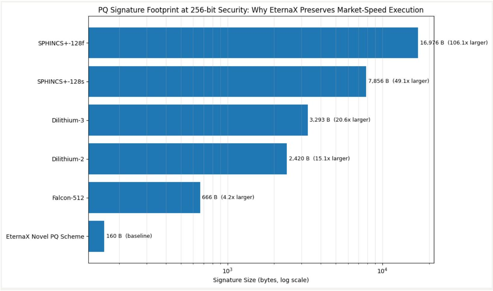

# Quantum Risk Is a Cost Curve: Why Ethereum Is Late, Bitcoin Needs 7 Years, and EternaX Enables PQ-Native Stablecoin and RWA Issuance at Market Speed

.png)

Quantum risk is not a cliff. It is a cost curve. And that curve can move down in discontinuous jumps while defender migration moves in slow, governance-bounded steps.

If you hold stablecoins, tokenized RWAs, or DeFi collateral secured by today’s public-key cryptography, you are not only betting on math. You are betting on coordination speed across wallets, custody/MPC, exchanges, issuers, governance, and operational behavior.

The punchline: attacker capability can jump. defender migration is a multi-year coordination event. That mismatch is where real losses happen.

## The compression trend: the numbers that matter

Use RSA as a clean measuring stick for Shor-style pressure. Crypto relies heavily on elliptic-curve cryptography, not RSA, but RSA factoring estimates are still a directional signal for fault-tolerant resource pressure.

- 2021-era baseline (often cited): factoring RSA-2048 in hours was estimated at ~20 million noisy physical qubits under then-standard assumptions.
- 2025 (Craig Gidney, Google Quantum AI): reduced to < 1 million noisy qubits for RSA-2048 under updated assumptions.
- Feb 2026 (Pinnacle Architecture preprint): claims RSA-2048 could be factored with < 100,000 physical qubits under specific assumptions (physical error rate ~1e^-3, 1 microsecond cycle, 10 microsecond reaction time).

Critical discipline: these are resource estimates, not lab demonstrations. They are assumption-sensitive. But the signal is consistent: better codes, better architectures, better compilation keep lowering the effective bar.

## Why crypto is uniquely exposed

Quantum is a broad cybersecurity problem, but crypto has two properties that make it structurally harsher than “normal enterprise security”:

1. Public key exposure is routine Addresses, signatures, and often public keys are persistently observable at internet scale.
2. Finality is irreversible If authorization keys are compromised, there is no helpdesk. Ownership and settlement credibility collapse.

This is why major institutions increasingly frame quantum as board-level risk, not an R&D curiosity. Citi’s “Quantum Threat” report explicitly discusses how breaking public-key crypto undermines trust in blockchain transactions and immutability.

And the migration pressure is already institutionalized:

- NIST finalized the first post-quantum cryptography standards in 2024 (FIPS 203/204/205).
- NSA guidance emphasizes planning and budgeting for a quantum-resistant transition.

Crypto does not get to opt out of that vendor, policy, and procurement gravity.

## Why “Ethereum 2029” is structurally late

Ethereum is not asleep at the wheel. In January 2026, the Ethereum Foundation elevated post-quantum security to a strategic priority and formed a dedicated team, as reported by CoinDesk.

The issue is not intent. The issue is timelines vs adversary roadmaps.

## Hardware ambition does not wait for social coordination

IonQ’s published roadmap materials include targets such as 200,000 physical qubits and 8,000 logical qubits by 2029 (with additional targets beyond that). These are forward-looking and not guarantees, but they are still a public signal that shifts capital and expectations.

## The core mismatch

- Defender timelines: years of coordination across protocol changes, client upgrades, wallet/custody migration, exchange infrastructure, and user behavior.
- Attacker capability: can improve in jumps when architectures, codes, or manufacturing cross thresholds.

So the argument is not “Ethereum fails tomorrow.” The argument is: late-decade comprehensive migration is a governance bet, not a security plan.

## Bitcoin’s governance clock: the cleanest warning sign

Bitcoin is deliberately conservative. That conservatism is a feature for stability. It is also a constraint for emergency migrations. A recent
report quoting BIP-360 co-author Ethan Heilman states that Bitcoin could take ~7 years (2033) to migrate to full quantum resilience even if it started immediately, and frames that as optimistic if consensus is hard.

Whether you accept the exact number or not, the strategic implication is unavoidable:

If migration lead-time is measured in many years, the real question stops being “Will quantum arrive by 2030 ?” It becomes: Can the ecosystem coordinate fast enough if attacker capability arrives earlier than expected?

Bitcoin teaches the lesson crypto hates hearing: security is limited by governance throughput.

## Market speed is the hidden wall: why bigger signatures can break throughput

This is where most “upgrade later” plans get blindsided.

Blockchains are not private enterprise systems. They require universal verification by unknown third parties, at scale, under bandwidth and compute constraints.

## The baseline: compact signatures today

- Solana: each transaction signature is 64 bytes.
- Ethereum (ERC-2098): compact signature representation reduces to 64 bytes (from 65 bytes and alignment overhead).

## A well-known PQ example: Falcon signature sizes

Open Quantum Safe lists (implementation characteristics):

- Falcon-512: 752 bytes signature
- Falcon-padded-512: 666 bytes signature

That is roughly 10x to 12x the signature payload versus 64-byte signatures.

## Why “10x signature bytes” matters

> Justin Drake: “TPS… going to go down by a factor of 10… non-starter… from a commercial standpoint.”

Signature bloat taxes:

- Bandwidth and propagation (slower gossip, more orphan risk, heavier networking)
- Verification CPU (more work per transaction)
- Storage and state growth
- Decentralization pressure (nodes get heavier, hardware requirements rise)

And it can collide with hard transport constraints. For example, Solana is explicit about its transaction structure and signature sizing. When signature bytes inflate by an order of magnitude, you burn a much larger portion of the fixed payload budget on signatures alone.

This is the uncomfortable truth: PQ can become a throughput and fee shock if you adopt heavy primitives without engineering around blockchain constraints.

Markets do not reward “secure but slow.” They migrate to where execution stays fast.

## Stablecoins and RWAs are authorization products. PQ must start at issuance.

Most discussions about quantum in crypto focus on wallets and user keys. For issuers, that is incomplete.

A stablecoin or tokenized RWA is not just a token. It is an authorization perimeter with multiple high-impact control surfaces, typically including:

- Mint / burn controls
- Freeze / blacklist / seize controls (jurisdiction and compliance actions)
- Upgrade authority (proxy admin, implementation upgrades)
- Reserve and collateral workflows (custody and attestations)
- Oracles and settlement dependencies (feeds, validators, sequencers, bridges)

If those issuer and governance keys are compromised, the asset is not “discounted.” It is structurally impaired. A dollar can gap to zero because settlement credibility breaks.

This is why “we will migrate later” is not a technical plan for issuers. It is a distribution and liquidity risk:

- Liquidity venues dislike version splits.
- Market makers dislike uncertainty about redemption and settlement.
- Custodians dislike re-audits and emergency migrations.
- Exchanges dislike chaotic asset-perimeter changes.
“Migrate later” becomes a liquidity fracture event: the market leaves before the patch ships.

## Where EternaX Labs fits: mechanism-first, not marketing

EternaX exists because the market needs PQ-safe authorization without a market-speed penalty.

## 1 Why issuers mint quantum safe day one on EternaX

Issuance is the moment the authorization perimeter is born. If you mint a stablecoin or RWA on a chain that is not post-quantum safe at the authorization layer, you are implicitly committing to a future “flag day” migration across:

- wallets and custody/MPC
- exchanges and listing infrastructure
- collateral integrations and DeFi venues
- compliance tooling and audit scope
- operational runbooks and emergency playbooks

Issuers do not want to replatform the perimeter later. They want it born PQ-safe.

PQ-native day one means:

- the primary issuance rail is already on PQ-safe authorization primitives
- the asset avoids a future forced perimeter migration under stress
- the issuer’s security posture is aligned with NIST/NSA direction now, not “someday”

## 2 Where “market speed” comes from: PQ designed for blockchain constraints

Most chains will approach PQ by swapping in standardized PQ signature families and accepting the overhead.

EternaX takes a different design stance: the PQ authorization layer must be engineered around blockchain physics, meaning:

- Signature bytes matter (propagation, payload limits, storage)
- Verification cost matters (CPU per transaction, node scaling)
- Universal verifiability matters (no permissioned verifier sets, no “trusted relays”)

This is the core wedge: instead of inheriting a Falcon-class signature payload tax (hundreds of bytes per signature), EternaX is designed around a protocol-native PQ signature approach built from the ground up for high-throughput, high-finality blockchain use cases, specifically to avoid the throughput cliff that heavy PQ signatures can impose. (Falcon sizes are a good reference point for why the cliff exists.)

Put plainly:

- If PQ primitives balloon signatures, you risk TPS haircuts and fee pressure.
- If PQ is engineered at the protocol layer for low overhead, you preserve market speed while upgrading authorization security.

## 3 Why this matters specifically for stablecoins and RWAs

Stablecoins and RWAs compete on:

- redemption credibility
- listing breadth
- liquidity depth
- operational reliability
- compliance-ready flows

EternaX is positioned as a PQ-native settlement and issuance rail where:

- authorization is PQ-safe at issuance (no future perimeter “rebuild”)
- execution remains fast because PQ was engineered for blockchain constraints
- “auditable privacy” supports compliant flows without broadcasting sensitive balances and positions

This is not “PQ someday.” This is PQ-native day one, at market speed.

## What to do next: a rational 2026 posture for issuers and builders

This is not a call to panic. It is a call to remove a tail risk before the market forces it.

If you are an issuer, exchange, custodian, or DeFi venue:

1. Treat PQ as a multi-year migration program, not a patch.
2. Model the throughput and fee impact of PQ signature inflation early.
3. Avoid designing assets that require a late-decade perimeter replatform under stress.
4. For stablecoins and RWAs, prioritize PQ-native day-one issuance rails to protect distribution and liquidity.
5. Connect with EternaX Labs today at info@eternax.ai

**The market will not wait for slow coordination. It will route around it. That is why we built EternaX.**

*EternaX Labs is a post-quantum, market-speed blockchain built for stablecoins, tokenized cash, RWAs, and high-velocity on-chain markets. Its core advantage is a [protocol-native novel post-quantum scheme](../silmarils-post-quantum-authentication-without-size-tax/index.html) designed to keep real markets fast while upgrading authorization security. In EternaX materials, the PQ signature size is ~160 bytes, targeting low single-digit overhead and ~120 ms spendable finality, rather than accepting Falcon-class throughput haircuts that can compress TPS, raise fees, and degrade liquidity. EternaX also provides auditable privacy (selective disclosure with verifiable controls) so serious flows can move with transparency where required and confidentiality where necessary. For issuers and investors, the wedge is direct: mint PQ-native stablecoins day one, avoid future perimeter-migration and liquidity-fracture risk, and scale on rails engineered for speed, security, and continuity. For more details, contact info@eternax.ai*