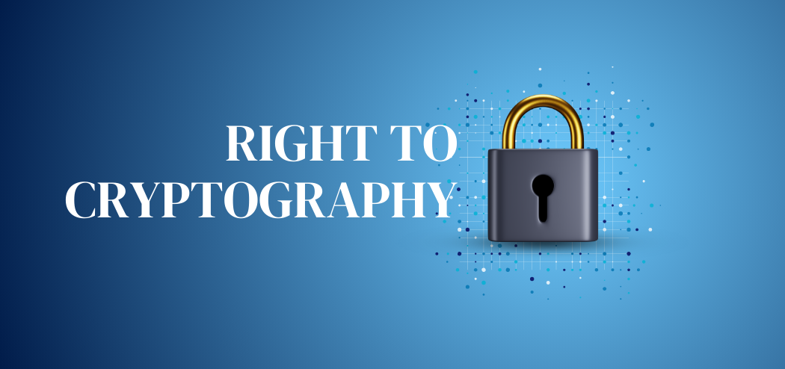

# The Right to Cryptography

The transformation of cryptography from a classified military capability into a public good was not an accident of technological progress. It was the resolution of a structural conflict: secrecy-based security cannot coexist with open societies, distributed economies, and global communication networks. Cryptography became public because modern society required it to.

In the decades following World War II, cryptography was treated as a sovereign instrument. Its purpose was national defense, its users were intelligence agencies, and its legitimacy rested on secrecy. This model assumed a world of centralized actors, controlled channels, and hierarchical trust. Computers dismantled these assumptions. They multiplied the scale of communication, removed the need for physical proximity, and enabled interactions between parties with no shared institutional backing. Under these conditions, secrecy ceased to be a stabilizing force and became a bottleneck.

The civilian demand for cryptography did not arise from abstract privacy concerns, but from concrete social needs. Banking without physical presence, electronic payments, automated clearing, and later electronic commerce all required guarantees that could not be enforced by law or reputation alone. Cryptography provided a substitute for institutional trust where institutions themselves could not reach. This is the first sense in which cryptography benefited society: it enabled participation in economic life without requiring personal connections, physical presence, or privileged access.
<figure>

<figcaption>Horst Feistel, whose research at IBM led to the first public encryption standard - DES</figcaption>
</figure>

The publication of the Data Encryption Standard (DES) in 1977 marked a decisive shift. For the first time, a cryptographic algorithm was standardized for civilian use and subjected to open scrutiny. This openness was not a concession; it was a prerequisite for legitimacy. Once algorithms could be examined, attacked, and improved publicly, security became a property of design rather than authority. This change redistributed power. Individuals, companies, and academics could now verify the mechanisms that protected them instead of trusting opaque institutions.

Public-key cryptography pushed this redistribution further. By eliminating the need for a pre-shared secret, it removed a structural dependency on trusted intermediaries. Secure communication became possible by default, not by permission. The social implication is often understated: public-key cryptography made privacy scalable. It allowed secure interaction among strangers, which is the defining condition of modern societies. Without it, large-scale coordination would either collapse or require pervasive surveillance.

<figure>

<figcaption>Public-key cryptography pioneers Ralph Merkle, Martin E. Hellman, and Whitfield Diffie</figcaption>
</figure> 

The historical fact that similar systems were independently developed inside intelligence agencies but kept classified reinforces the argument. Secrecy did not prevent discovery; it only delayed diffusion. Society paid the cost in slower innovation, weaker security practices, and restricted access. Once released, the same ideas proved more robust precisely because they were public. This pattern undermines the notion that cryptographic secrecy protects society. Evidence suggests the opposite: secrecy concentrates power without increasing safety.

The rise of the internet made these dynamics unavoidable. Plaintext communication at global scale is incompatible with social stability. Fraud, censorship, surveillance, and manipulation become systemic risks, not edge cases. Cryptography addressed these risks not by eliminating them, but by restoring asymmetry: it made abuse expensive and resistance cheap. This asymmetry is the second societal benefit. Cryptography does not guarantee fairness, but it raises the cost of coercion and lowers the cost of dissent.

By the 21st century, cryptography had expanded beyond confidentiality. Authentication, integrity, digital signatures, and consensus mechanisms now support identity, governance, and value transfer. Cryptocurrencies and decentralized systems extend the same logic: they reduce reliance on centralized trust by replacing it with verifiable computation. Whether or not specific implementations succeed, the underlying principle is consistent with the past fifty years of cryptographic history.

Framing this trajectory as a “right to cryptography” is therefore not rhetorical excess. Rights emerge when societies recognize that certain capabilities are prerequisites for meaningful participation. In a digital world, the ability to communicate privately, authenticate oneself, and transact securely is not optional. Denying access to cryptography is functionally equivalent to denying access to speech, commerce, or association.

Cryptography became a public good because modern society made secrecy-based security obsolete. Its continued openness is not merely a technical preference, but a political and economic necessity. The historical lesson is clear: when cryptography is public, society gains resilience. When it is restricted, power centralizes, trust erodes, and progress slows.