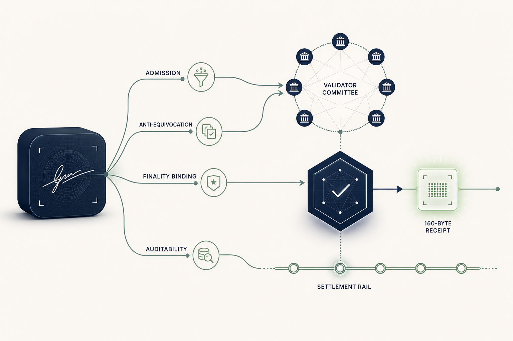

# Unbundling the Transaction Signature: Finality Was Always the Anchor

Every blockchain in production today rests on a tiny per-transaction signature that is doing several jobs at once. It admits the transaction, it pins it to one value, becomes the permanent on-chain record, and lets a future auditor verify the transaction long after the fact. ECDSA is small enough that bundling all of those jobs into one object is essentially free.

Post-quantum cryptography breaks that bargain. The NIST-standardized post-quantum signatures are an order of magnitude larger than ECDSA at the cheap end and roughly two orders of magnitude larger at the conservative end. SPHINCS+ at 50,000 transactions per second is tens of terabytes of signature material per day that have to be stored, served to nodes, and verified by light clients forever.

Instead of paying that size tax on every transaction, we designed a specialized architecture for BFT blockchains that does not bundle every signature job into a single per-transaction object. We call it the *unbundled protocol*: the four jobs that an ECDSA signature collapses into one object are split across two different verifier models, with three of the four jobs discharged in consensus and one carried by a small permanent receipt. That receipt is the [SILMARILS primitive](https://arxiv.org/abs/2605.03230) we published in May 2026: a 160-byte designated-verifier signature suited to validator-mediated authentication.

That is the bigger architectural point. Post-quantum migration is not a wallet upgrade or a signature swap. For stablecoins, tokenized treasuries, tokenized deposits, exchanges, custodians, and market infrastructure, authorization is part of the asset perimeter. If every transfer has to carry kilobytes of permanent authentication data, the system may become quantum-safe in theory while becoming slower, more expensive, more linkable, and harder to operate in practice.

Unbundling the transaction signature is how EternaX avoids that tradeoff. Conservative post-quantum signatures stay where universal public verification is actually needed: account setup, delegation, key rotation, withdrawal, and other session-level operations. The hot transaction path uses validator-mediated authentication, BFT finality as the public trust anchor, and a compact finality-anchored receipt for later audit. The result is not only smaller signatures. It is the architecture that lets post-quantum security, auditable privacy, and market-speed settlement coexist.

As far as we are aware, this is the first concrete framework that makes the decomposition explicit and assigns each signature job to the verifier model best suited to it.

## A 64-byte signature does four things at once

ECDSA on a public chain is doing four jobs simultaneously, on every transaction:

1. **Admission.** Convincing a validator that the transaction is authorized for the named account so it can be included in a block.
2. **Anti-equivocation.** Binding the included transaction to a single user-authored value: a malicious relay node sitting between the user and the validator cannot substitute a different message for the same nonce without producing a fresh signature.
3. **Finality binding.** Once published, the signature is on chain forever and any third party can confirm that the named public key signed the transaction bytes.
4. **Auditability.** A future regulator, exchange, or counterparty can verify, at any later time, that this specific historical transaction was authorized by the named account, with no help from the chain operator.

The compactness of ECDSA made it cheap for one primitive to serve all four jobs at once. A post-quantum migration cannot afford that bundling, and the question becomes which of the four a permanent per-transaction signature still has to do.

## What BFT finality anchors

In any BFT blockchain, a transaction is "valid" not because it carries a valid signature, but because the committee finalized it under the protocol's validity rules. Whether the bytes had a correct nonce, sufficient balance, valid policy, valid execution, and inclusion in canonical history is already a consensus-state claim, even in the ECDSA world. The signature was only ever proving the first job: admission. The remaining three are consensus-dependent.

BFT finality is not a side effect of the chain. *It is the trust anchor, the artifact a third party ultimately relies on when treating the chain as authoritative.* A signed finality certificate from at least 2f+1 validators, under the standard f < N/3 honest-majority threshold, is the statement "this transaction was admitted by the committee." That statement is what a third party actually relies on when they treat the chain as authoritative.

This is the structural observation behind the unbundled-signature pattern. Once finality is named as the trust anchor, the per-transaction signature only has to do whatever finality cannot.

## Three of the four jobs move into consensus

Of the four jobs above, three can be discharged before or at finality without any permanent public-key signature material:

| Job               | Who discharges it in the unbundled pattern                                                                                                                                                                                                                                 |
| ----------------- | -------------------------------------------------------------------------------------------------------------------------------------------------------------------------------------------------------------------------------------------------------------------------- |
| Admission         | The committee's validity rule. A finalized transaction is one the committee admitted under the protocol's identity, shared-state, and execution checks.                                                                                                                    |
| Anti-equivocation | A consensus-time information-checking layer evaluated by the committee at admission time. BFT agreement prevents two conflicting finalized values; the information-checking layer binds the value being finalized to the user-authored transaction the validator received. |
| Finality binding  | The finality certificate itself. A signed certificate from 2f+1 validators is the public proof that the committee admitted the transaction; a light client does not need the user to re-prove anything.                                                                    |
| Auditability      | A small finality-anchored designated-verifier receipt, verifiable at arbitrary later time by a third party who accepts the chain's finality as authoritative. This is the only job that genuinely needs a permanent primitive surviving the consensus event.               |

The SILMARILS primitive is what fills the auditability slot: a 160-byte receipt, selectively openable per transaction, with no public account-level key on chain to serve as a long-lived correlation handle. The cryptographic core is in the paper.

## A principled substitution

The trust anchor of the unbundled protocol is BFT finality plus a small verifiable receipt. The ECDSA-on-a-public-chain equivalent is the public-key infrastructure plus the chain, since a third party has always had to consult both to know whether a transaction was valid and finalized. The trust assumption is identical to any other BFT chain, f < N/3, plus standard binding and channel assumptions on the session setup. The corruption threshold is the same; the artifact that carries each guarantee is different.

For a post-quantum chain this is the right place to put the cost. Conservative PQ public-key signature (SPHINCS+, or any standardized PQ scheme) is retained at the session level, at account creation, delegation, key rotation, and withdrawal, where they earn their size on operations that genuinely need universal third-party verifiability and where the cost is paid once per session rather than once per transaction.

## What this buys

| Property                                             | ECDSA-style PQ migration                    | Unbundled-signature pattern    |
| ---------------------------------------------------- | ------------------------------------------- | ------------------------------ |
| Per-transaction permanent record                     | 666 B – 17 KB                               | ~160 B                         |
| Storage at 50,000 transactions per second            | 2.9 TB/day (Falcon) to 33 TB/day (SPHINCS+) | ~691 GB/day                    |
| Address-to-history linkability for outside observers | Public, automatic                           | None without disclosure        |
| Selective disclosure for an auditor                  | Requires zero-knowledge machinery           | A small reveal per transaction |
| Public trust anchor                                  | Per-tx public-key verifiability + finality  | BFT finality                   |

The structural gain is that the pattern recovers selective-disclosure privacy from external observers, audit on demand, and a smaller permanent record without stacking a SNARK on top of every transaction. Zero-knowledge proofs remain useful for statements that are inherently about hidden data; they are just no longer required only to recover the per-transaction auditability that the bundled signature used to give for free.

This architecture is not a replacement for post-quantum public-key signatures: SPHINCS+ remains the right primitive for session-level operations. And it is not a claim about consensus efficiency: the throughput improvement comes from storage and bandwidth compaction, not from changes to the consensus path itself.

## Why this matters for market infrastructure

The strategic issue is whether post-quantum security can become production market infrastructure without turning authentication into a permanent throughput tax.

For stablecoin issuers and RWA platforms, the signature layer is not an implementation detail. It protects mint and burn controls, custody instructions, compliance actions, treasury movements, collateral transfers, settlement workflows, and user transactions. If the migration path bloats each transaction by kilobytes, the cost shows up where markets are most sensitive: fees, latency, validator requirements, archive size, exchange integration, and liquidity venue economics.

It also shows up as migration debt. Assets issued on classical rails inherit future coordination work: wallet upgrades, custody re-platforming, exchange support, compliance re-certification, bridge handling, and liquidity fragmentation. "Upgrade later" is a multi-year market-structure event, not a backend switch.

The unbundled pattern changes the choice. Issuers can get a post-quantum-native authorization perimeter without forcing every transaction to become a public, reusable, kilobyte-scale signature object. Validators can verify authorization inside the protocol path. Finality can remain the public settlement anchor. Auditors can still receive transaction-specific evidence when disclosure is required. External observers do not automatically get a permanent account-level linkability handle on every transaction.

That is the same category-level "so what" behind EternaX: the next institutional settlement rail has to be private where markets require confidentiality, auditable where regulators and counterparties require evidence, composable enough for DeFi-style collateral mobility, and post-quantum from genesis. A chain that solves only the cryptography problem but loses market speed does not solve the infrastructure problem. A chain that delivers privacy on classical keys leaves historical flows exposed when those keys break. The architecture has to solve the bundle.

## Outlook

The cryptographic core of this pattern at the audit layer is in the SILMARILS paper. The full integration of the consensus-time information-checking layer evaluated by the validators, the session-state binding, the per-transaction parameter derivation, and the operational details, is the subject of a forthcoming companion paper, expected later this year.

The point we want to make is the architectural one. Post-quantum migration for blockchains is not a primitive-substitution problem. It is an opportunity to recognize that the four jobs a classical signature was bundling never had to live in the same object, and that for a BFT chain, three of those four already belonged in consensus.

The unbundled-signature pattern: BFT finality as the public trust anchor; conservative PQ public-key signatures retained at session level; a consensus-time information-checking layer for relay integrity; a small finality-anchored designated-verifier receipt as the permanent record; is, as far as we are aware, the first concrete framework that names the decomposition and assigns each job to the verifier model best suited to it.

That is what makes a high-throughput post-quantum settlement layer possible without paying kilobytes of signature data on every transaction, without giving up auditability, and without taking on the implementation surface area of a ZK system on the hot path. The bigger claim is that the winning post-quantum chain will not be the one that simply swaps ECDSA for a larger public signature. It will be the one that preserves the properties institutions actually need at the same time: durable authorization security, controlled disclosure, public finality, composable settlement, and execution quality under real market volume.